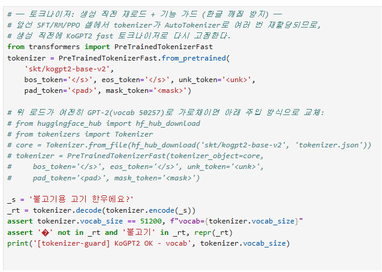
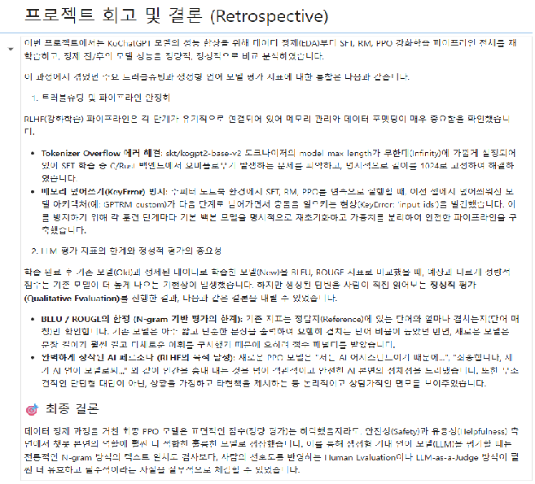

# AIFFEL Campus Online Code Peer Review Templete
- 코더 : 이다겸 님
- 리뷰어 : 김민 님

# PRT(Peer Review Template)
- [x]  **1. 주어진 문제를 해결하는 완성된 코드가 제출되었나요?**
    - 문제에서 요구하는 최종 결과물이 첨부되었는지 확인
        - 중요! 해당 조건을 만족하는 부분을 캡쳐해 근거로 첨부

강화학습과 학습 결과를 보여주는 코드가 잘 작성되었고  
결과 또한 잘 나왔습니다  
    
- [x]  **2. 전체 코드에서 가장 핵심적이거나 가장 복잡하고 이해하기 어려운 부분에 작성된 
주석 또는 doc string을 보고 해당 코드가 잘 이해되었나요?**
    - 해당 코드 블럭을 왜 핵심적이라고 생각하는지 확인
    - 해당 코드 블럭에 doc string/annotation이 달려 있는지 확인
    - 해당 코드의 기능, 존재 이유, 작동 원리 등을 기술했는지 확인
    - 주석을 보고 코드 이해가 잘 되었는지 확인
        - 중요! 잘 작성되었다고 생각되는 부분을 캡쳐해 근거로 첨부

복잡한 코드인데 주석을 잘 남겨두어서
코드를 좀 더 쉽게 이해할 수 있었습니다
        
- [x]  **3. 에러가 난 부분을 디버깅하여 문제를 해결한 기록을 남겼거나
새로운 시도 또는 추가 실험을 수행해봤나요?**
    - 문제 원인 및 해결 과정을 잘 기록하였는지 확인
    - 프로젝트 평가 기준에 더해 추가적으로 수행한 나만의 시도, 
    실험이 기록되어 있는지 확인
        - 중요! 잘 작성되었다고 생각되는 부분을 캡쳐해 근거로 첨부
     
프로젝트 회고 및 결론에  
Tokenizer Overflow 에러 해결 내용과  
메모리 덮어쓰기(KeyError) 방지  
에 대한 내용을 서술 하고 에러 해결방안까지 기록 되어 있습니다  
        
- [x]  **4. 회고를 잘 작성했나요?**
    - 주어진 문제를 해결하는 완성된 코드 내지 프로젝트 결과물에 대해
    배운점과 아쉬운점, 느낀점 등이 기록되어 있는지 확인
    - 전체 코드 실행 플로우를 그래프로 그려서 이해를 돕고 있는지 확인
        - 중요! 잘 작성되었다고 생각되는 부분을 캡쳐해 근거로 첨부

  

회고 작성이 잘 되었습니다  

        
- [x]  **5. 코드가 간결하고 효율적인가요?**
    - 파이썬 스타일 가이드 (PEP8) 를 준수하였는지 확인
    - 코드 중복을 최소화하고 범용적으로 사용할 수 있도록 함수화/모듈화했는지 확인
        - 중요! 잘 작성되었다고 생각되는 부분을 캡쳐해 근거로 첨부

코드 전체가 불필요한 중복 없이 간결하고 효율적으로 작성되었습니다  

# 회고(참고 링크 및 코드 개선)
# 코드 리뷰 회고

이번 코드를 리뷰하면서 가장 인상 깊었던 점은 단순히 KoChatGPT 예제 코드를 실행하는 수준에 머무르지 않고,  

현재 실행 환경에서 발생하는 문제를 직접 분석하고 해결하면서 전체 RLHF 파이프라인을 완성하셨다는 점입니다.  

코드는 Base Model 확인부터 SFT, Reward Model, PPO 학습, 데이터 정제, 재학습, 최종 평가까지 순차적으로 구성되어 있었습니다.  

각 단계가 마크다운 설명과 함께 구분되어 있어 전체 실험의 흐름을 따라가기 쉬웠으며,  

코드만 나열하기보다 해당 코드를 실행하는 이유와 결과에 대한 해석까지 함께 기록하신 점이 좋았습니다.  

특히 처음 코드를 접하는 사람도 SFT, RM, PPO가 어떤 순서로 연결되는지 이해할 수 있도록  

노트북을 구성하신 부분에서 작성자분의 세심함이 느껴졌습니다.  

초기 환경 설정 부분에서는 최신 Colab 환경과 기존 KoChatGPT 코드 사이의 호환성 문제를 해결하기 위한 코드가 돋보였습니다.  

`torch.load`의 `weights_only` 설정을 보완하고, 더 이상 사용하기 어려운 `ColossalAIStrategy` 관련 의존성을 제거하며,  

일반 `tqdm`을 `tqdm.notebook`으로 변경한 부분은 실행 환경을 정확히 파악한 대응이라고 생각합니다.  

외부 코드를 그대로 사용하는 대신 실제 환경에서 정상적으로 동작하도록 수정 사항을 자동화하신 점이 특히 인상적이었습니다.  

파일을 수정하는 로직을 별도의 `modify_file` 함수로 구성한 점도 좋았습니다.  

수정할 파일과 변경 내용을 딕셔너리 형태로 관리하여 어떤 파일의 어떤 코드를 변경하는지 한눈에 확인할 수 있었습니다.  

이런 방식은 코드 수정 내역을 추적하기 쉽고, 동일한 환경을 다시 구성할 때도 재현성을 높여 줍니다.  

여러 파일을 수작업으로 고치는 것보다 훨씬 체계적인 접근이었다고 생각합니다.  

토크나이저를 검증하는 과정에서도 작성자분의 꼼꼼함이 잘 드러났습니다.  

단순히 모델과 토크나이저를 불러오는 데 그치지 않고, 어휘 크기와 한글 문자열의 인코딩 및 디코딩 결과를  

`assert`문으로 확인하셨습니다.  

라이브러리 버전에 따라 클래스 이름이 달라질 가능성을 고려하여 클래스 자체보다 실제 기능을 검증하신 방식도  

안정적인 코드 작성 습관이라고 느꼈습니다.  

또한 `tokenizer.model_max_length`에 표시되는 매우 큰 값을 그대로 신뢰하지 않고,  

실제 모델의 `n_positions` 값이 1,024라는 점을 확인하신 부분이 좋았습니다.  

이후 학습 코드에서 최대 길이를 명시적으로 설정하여 오버플로우 문제를 해결하신 것을 보며,  

오류 메시지만 임시로 우회한 것이 아니라 문제의 원인을 이해하고 해결하셨다는 인상을 받았습니다.  

Base Model의 생성 결과를 비교한 코드도 잘 구성되어 있었습니다.  

Greedy Search, Beam Search, Temperature와 Top-k Sampling, Top-p Sampling을 각각 실행하고   

결과를 표로 정리하여 디코딩 방식에 따른 차이를 명확하게 보여 주셨습니다.  

특히 실행 결과를 단순 출력으로 끝내지 않고 반복 생성, 문맥 이탈, 표현 다양성, 지시 이행 능력 부족 등의   

특징을 직접 분석하신 점이 좋았습니다.  

이러한 구성 덕분에 이후 SFT와 PPO가 왜 필요한지 자연스럽게 이해할 수 있었습니다.  

데이터 정제 코드에서는 학습 단계별 목적을 구분하여 처리한 점이 매우 인상적이었습니다.  

공통 `clean_text` 함수를 만들어 문자열 뒤에 잘못 포함된 `token`이나 `completion` 관련 파싱 흔적을 정규표현식으로 제거하셨고,  

불필요한 따옴표와 공백까지 함께 정리하셨습니다.  

반복되는 정제 로직을 하나의 함수로 분리하여 코드 중복을 줄인 점도 좋은 설계였습니다.  

특히 SFT, RM, PPO 데이터를 모두 같은 기준으로 처리하지 않은 점을 높이 평가하고 싶습니다.  

SFT에서는 빈 프롬프트와 중복 프롬프트를 제거하고, Reward Model에서는  

빈 답변이 낮은 품질의 응답으로 활용될 수 있다는 점을 고려하였으며,  

PPO에서는 중복 프롬프트를 정리하셨습니다.  

데이터의 형식만 보고 일괄적으로 제거한 것이 아니라,  

각 학습 단계에서 데이터가 수행하는 역할을 고려하여 정제 기준을 달리하신 점이 매우 적절했습니다.  

SFT 재학습 코드에서는 모델을 다시 불러와 이전 단계에서 사용한 객체와 분리하셨고,  

`remove_unused_columns=False`를 지정하여 Trainer가 필요한 입력 값을 제거하지 않도록 처리하셨습니다.  

주피터 노트북에서는 셀을 실행하는 순서에 따라 변수나 모델 객체가 덮어써질 수 있는데,  

이러한 특성을 파악하고 각 단계의 모델을 명확히 분리하신 부분이 좋았습니다.  

Reward Model 학습에서는 세 개의 응답 순위를 비교하여 가능한 쌍별 데이터를 생성하고,  

각 쌍의 `chosen`과 `rejected`를 명시적으로 구성하셨습니다.  

반복되는 코드가 다소 길어질 수 있는 부분이지만, 각 비교 관계를 명확하게 보여 주기 때문에  

학습 데이터가 어떻게 만들어지는지 이해하기 쉬웠습니다.  

Reward Model의 학습 원리를 코드로 직접 확인할 수 있도록 작성하신 점이 교육적으로도 좋았습니다.  

PPO 단계에서는 정제된 SFT 모델을 Actor로, 정제된 Reward Model을 Critic과 Reward Model 구성에 활용하고,  

Actor를 복제하여 Reference Model로 사용하는 흐름이 잘 드러났습니다.  

각 모델의 역할을 분리하면서도 이전 단계의 결과물을 다음 단계에 연결하여 RLHF 파이프라인을 완성하셨습니다.  

특히 `deepcopy`를 사용하여 학습 과정에서 기준 모델과 보상 모델의 가중치가 의도치 않게  

함께 변경되는 것을 방지하신 점이 안정적인 구현이라고 생각합니다.  

학습 후 기존 모델과 정제된 모델의 답변을 직접 생성하고 비교한 점도 좋았습니다.  

작성자분께서는 BLEU와 ROUGE 점수만 제시하지 않고 실제 생성 문장을 함께 살펴보며  

정량 평가와 정성 평가가 다르게 나타날 수 있다는 점을 분석하셨습니다.  

예상과 다른 결과가 나왔을 때 이를 단순히 실패로 판단하지 않고,  

답변 길이와 표현 방식, AI 페르소나, 질문에 대한 직접성 등을 함께 검토하신 태도가 인상적이었습니다.  

코드 전반에는 `[FIX]`, 별표, 체크 표시, 단계별 출력문 등이 적절히 포함되어 있어  

긴 노트북에서도 현재 어떤 작업을 수행하고 있는지 쉽게 파악할 수 있었습니다.  

모델 저장 경로도 단계별로 분리되어 있어 SFT, RM, PPO 결과물이 섞이지 않도록 관리하신 점이 좋았습니다.  

전체적으로 작성자분께서는 복잡한 RLHF 파이프라인을 단계별로 분리하여 구현하셨고,  

실행 중 발생한 호환성 문제와 메모리 충돌, 토크나이저 길이 문제를 직접 해결하셨습니다.  

또한 데이터 정제와 재학습, 생성 결과 비교까지 하나의 노트북 안에서 재현할 수 있도록 구성하셨습니다.

무엇보다 오류가 발생했을 때 단순한 임시 조치로 넘어가지 않고 원인을 분석하여 코드에 반영하신 점이 인상 깊었습니다.  

작성자분의 코드는 모델 학습 결과뿐 아니라 실험 과정과 판단 근거까지 잘 기록되어 있어,  

다른 사람이 읽고 학습하거나 실험을 이어 가기에도 좋은 코드라고 생각합니다.  

복잡한 내용을 끝까지 정리하고 실제 동작하는 형태로 완성하신 점을 높이 평가하고 싶습니다.  

수고하셧습니다.  

