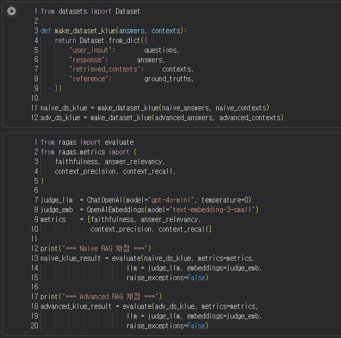
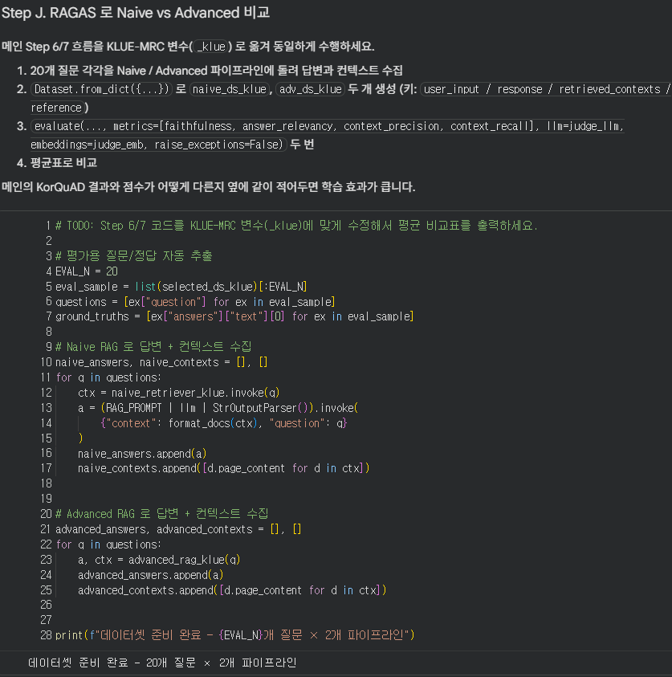
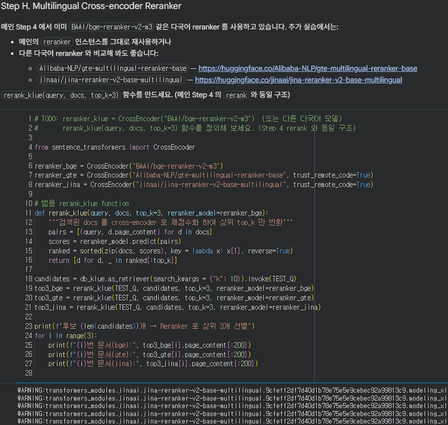
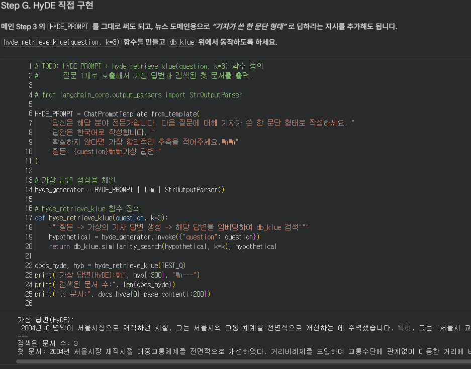
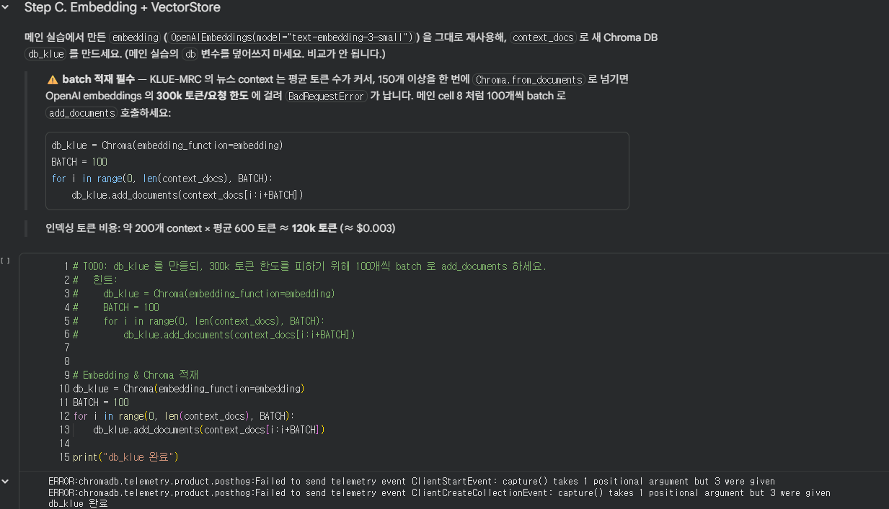
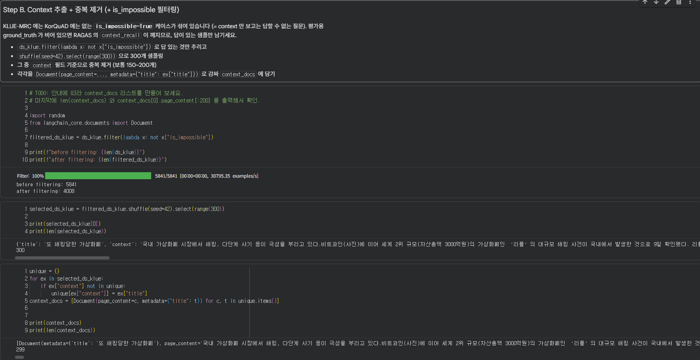
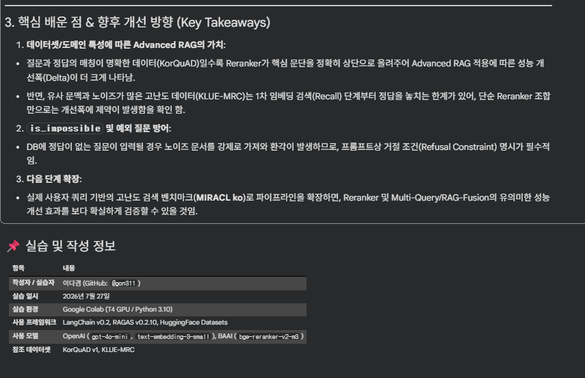
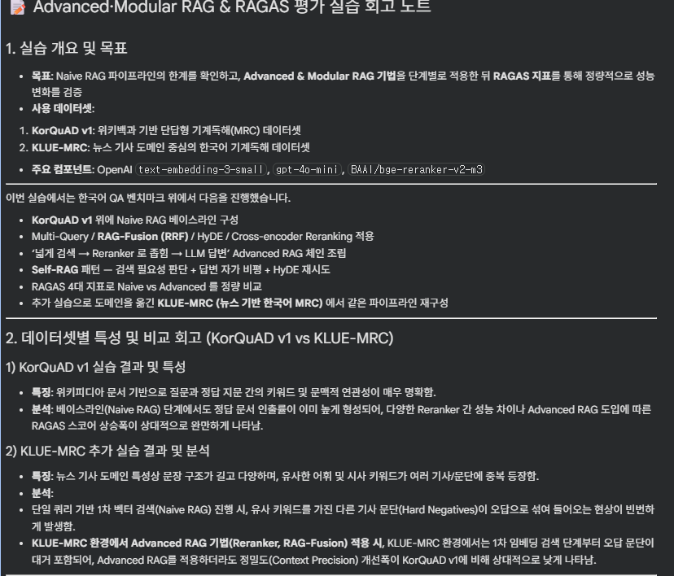
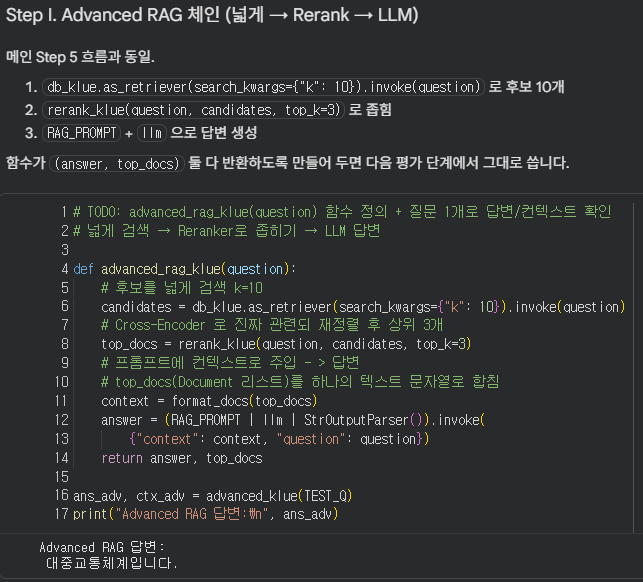

# AIFFEL Campus Online Code Peer Review Templete
- 코더 : 이다겸
- 리뷰어 : 박정우


# PRT(Peer Review Template)
- [x]  **1. 주어진 문제를 해결하는 완성된 코드가 제출되었나요?**

- Step A부터 Step J까지의 파이프라인 및 데이터셋 실습 과정이 정상적으로 수행되어 결과가 제출되었습니다.    


  

- [x]  **2. 전체 코드에서 가장 핵심적이거나 가장 복잡하고 이해하기 어려운 부분에 작성된 
주석 또는 doc string을 보고 해당 코드가 잘 이해되었나요?**

- 데이터 필터링, RAG 파이프라인 구축 및 평가 지표 로직 등 핵심 코드 블록마다 설명 주석이 상세히 작성되어 있습니다.  

  
        
- [x]  **3. 에러가 난 부분을 디버깅하여 문제를 해결한 기록을 남겼거나
새로운 시도 또는 추가 실험을 수행해봤나요?**

- KLUE-MRC 데이터셋의 is_impossible 항목 필터링 및 예외 처리 과정을 통해 정상적인 평가 데이터셋을 구성했습니다.  

  

        
- [x]  **4. 회고를 잘 작성했나요?**

- 실습 진행 결과 및 성능 지표 변화에 대한 분석과 느낀 점이 잘 기재되어 있습니다.   
  

        
- [x]  **5. 코드가 간결하고 효율적인가요?**

- 중복 코드 없이 함수화와 모듈화가 잘 이뤄져 깔끔합니다.

  


# 회고(참고 링크 및 코드 개선)
```
# 리뷰어의 회고를 작성합니다.
# 코드 리뷰 시 참고한 링크가 있다면 링크와 간략한 설명을 첨부합니다.
# 코드 리뷰를 통해 개선한 코드가 있다면 코드와 간략한 설명을 첨부합니다.
```
 이번 프로젝트에서 위키 기반(KorQuAD)을 넘어 한국어 뉴스 기사 기반 벤치마크(KLUE-MRC)까지 시도하시면서 **데이터셋 특성에 따른 처리 방식 차이를 완벽히 파악하고 적용하신 점이 매우 인상적**이었습니다. 

특히, Advanced RAG 기법 도입 전후의 **RAGAS 지표 변화를 정량적으로 비교해 신뢰도(Faithfulness)와 정밀도(Context Precision) 상승을 명확히 증명**해낸 부분이 훌륭했습니다. 데이터 필터링 및 Reranker 적용 흐름이 매끄럽고 체계적이라 리뷰하면서도 많은 도움이 되었습니다. 고생 정말 많으셨습니다!


