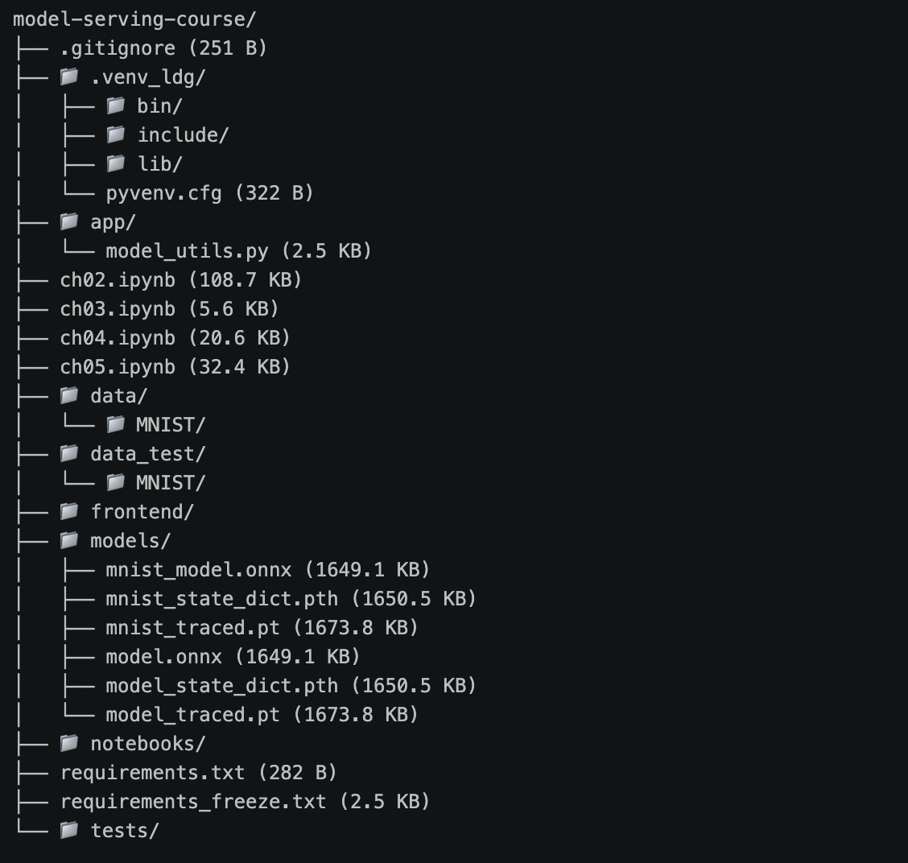

# model_serving_day1

작성일: 2026년 8월 12일

---

# 5-7 수행 내역 캡쳐



---

### ✅ 체크포인트 01

다음 질문에 답할 수 있다면, 이 섹션의 학습 목표를 달성한 것입니다:

1. `.pth` 파일만 전달했을 때, 상대방이 모델을 바로 사용할 수 없는 이유는 무엇입니까?
    - 실행환경(의존선)이 공유되지 않거나, 버전이 충돌하거나, 모델 구조 코드가 필요하거나, 전처리 로직 누락되는 등 의 문제가 발생할 수 있으며 이 문제은 공통적으로 모델이 특정 환경에 갇혀 있기 때문에 발생한다.
2. 모델 학습(Training)과 모델 배포(Serving)의 핵심 차이를 한 문장으로 설명할 수 있습니까?
    - 모델 학습은 특정 환경에서 최고 성능의 모델을 만드는 것이고, 모델 배포는 다양한 환경에서 해당 모델이 안정적으로 제공되게 하는 것이다.
3. 모델 배포에서 사용자와 서버가 소통하는 방식은 무엇입니까?
    - HTTP(API)

---

### ✅ 체크포인트02

다음 질문에 답할 수 있다면, 이 섹션의 학습 목표를 달성한 것입니다:

1. 가상환경 없이 `pip install`을 하면 패키지가 어디에 설치됩니까? 그것이 왜 문제가 될 수 있습니까?
    
    가상환경을 구축하지 않은 상태에서 패키지를 설치하면 시스템 Python(전역)에 설치가 된다. 이 경우 다른 프로젝트에서 설치한 버전이 이미 존재할 경우 새로운 버전을 설치함에 따라 프로젝트 구동에 문제가 생길 수 있다. 따라서 프로젝트마다 독립된 패키지 공간을 만들어서 서로 간섭하지 않도록 격리하는 것이 필요하다. 
    
2. `pip freeze`로 생성한 파일과 직접 작성한 `requirements.txt`의 차이는 무엇입니까?
    
    requirements.txt는 생성자가 직접 관리하는 핵심적인 패키지 목록을 기록하고 있고, pip freeze로 생성할 경우 하위 의존성까지 모두 포함하여 정밀한 재현에 유리하다. 다만 목록이 길어 가독성이 떨어진다. 
    
3. 동료에게 프로젝트를 전달할 때, `.venv` 폴더 대신 무엇을 공유해야 합니까?
    - 동료에게 프로젝트를 전달할 때는 requirements.txt를 공유하여 실행환경(의존성) 세팅을 동일하게 맞춘다.

---

### ✅ 체크포인트03

다음 질문에 답할 수 있다면, 이 섹션의 학습 목표를 달성한 것입니다:

1. 모델 추론 요청에 GET이 아닌 POST를 사용하는 이유는 무엇입니까?
    - 본문에 정보를 담아서 보내야 하기 때문에 POST를 사용한다.
2. 상태 코드 `422`는 어떤 상황에서 발생합니까?
    - Unprocessable Entitiy, 즉 검증 실패를 의미하며 Pydantic 검증 에러시 발생한다.
3. `requests.post(url, json=data)`에서 `json=` 파라미터는 내부적으로 어떤 일을 합니까?
    - 자동으로 JSON으로 변환시키고 헤더를 설정한다.
4. Python의 `True`는 JSON에서 어떻게 표현됩니까?
    - true

---

### ✅ 체크포인트04

다음 질문에 답할 수 있다면, 이 섹션의 학습 목표를 달성한 것입니다:

1. `state_dict`로 저장한 `.pth` 파일을 불러올 때, 모델 클래스 정의가 필요한 이유는 무엇입니까?
    - pth로 저장된 파일 내에는 가중치 값(숫자)만 저장되어 있고 모델의 구조는 저장되어 있지 않다. 따라서 모델 클래스를 새로이 정의해주고 해당 모델 변수에 pth 파일에 저장된 가중치를 적용시켜야 한다.
2. `torch.jit.trace`와 `torch.jit.script`는 각각 어떤 상황에서 사용합니까?
    - 전자는 더미 입력을 실제로 통과시켜 연산 경로를 기록하며 대부분의 모델에서 잘 동작하지만 입력에 따라 분기하는 로직은 기록되지 않는다. 후자의 경우 Python 코드를 직접 분석하여 TorchScript IR로 컴파일하기 때문에 동적 로직도 변환된다. 단 Python 문법 중 지원되지 않는 것이 있어 에러가 발생할 수 있다. 따라서 모델에 if/else분기가 없다면 전자를, 입력에 따라 다른 연산 경로를 타는 모델이라면 후자가 적합하다.
3. ONNX의 가장 큰 장점은 무엇이며, 어떤 상황에서 선택해야 합니까?
    - Python, PyTorch에 의존하지 않고 ONNX Runtime 으로 제공하기 때문에 다양한 프레임워크에 호환 가능하고 추론속도가 빠르다. 따라서 추론 속도가 중요한 프로덕션 환경에 적합하다.
4. `torch.onnx.export()`에서 `dynamic_axes`를 지정하지 않으면 어떤 문제가 생길 수 있습니까?
    - 배치 사이즈가 1로 고정된다. 배포시 요청에 따라 배치 사이즈가 달라질 수 있기때문에 dynamic_axes로 가변 축을 지정하는 것이 좋다.

---

### ✅ 마치며

오늘 학습한 전체 내용을 점검합니다.

아래 질문에 모두 답할 수 있다면, Day 1의 학습 목표를 달성한 것입니다.

```
[섹션 1: 들어가며]
Q1. 모델 학습과 모델 배포의 핵심 차이를 한 문장으로 설명하세요.
	모델 학습은 특정 환경에서 모델의 최고의 성능을 도출해 내기 위한 실험 과정이고, 모델 배포는 완성된 모델을 다양한 사람들이 다양한 환경에서 사용할 수 있도록 하는 것이다. 
Q2. "내 컴퓨터에서는 되는데" 문제의 근본 원인은 무엇입니까?
	특정 실행 환경에서 제작된 모델은 해당 실행 환경에 의존한다. 따라서 동일하지 않은 실행 환경에서는 의존성의 불일치(예: OS차이, 패키지 버전 차이 등)이 발생할 수 있다. 

[섹션 2: 환경 세팅]
Q3. 가상환경을 사용하지 않으면 어떤 문제가 발생할 수 있습니까?
	다양한 프로젝트를 동일한 시스템 Python에서 수행할 경우 서로 다른 버전의 라이브러리를 사용해야 할 수 있고, 그 경우 프로젝트가 구동하지 않는 문제가 발생할 수 있다. 따라서 각 프로젝트마다 다른 가상환경을 구축하여 서로의 실행 환경을 격리하여야 한다. 
Q4. pip freeze와 직접 작성한 requirements.txt의 용도 차이는?
	직접 작성한 requirements.txt의 경우 내가 직접 설치한 "최상위 의존성"만 관리하고, pip freeze는 그 패키지들이 의존하는 "하위 의존성"까지 전부 기록하므로 정밀한 재현에 유리하다. 단 목록이 길어 가독성 측면에서는 불리하다. 
		
[섹션 3: RESTful API]
Q5. 모델 추론 요청에 POST를 사용하는 이유는?
	모델 추론을 위해서는 요청 내용이 함께 전달되어야 하는데, get은 본문(body)에 요청 내용을 추가할 수 없다. 따라서 본문에 요청내용을 기입할 수 있는 post를 사용한다.
Q6. 상태 코드 200, 400, 500은 각각 어떤 상황을 의미합니까?
	200: 정상 작동
	400: 잘못된 요청(입력 데이터 형식이 틀린 경우)
	500: 서버 에러 (모델 추론 중 예외가 발생한 경우)

[섹션 4: 모델 직렬화]
Q7. state_dict 방식은 왜 모델 클래스 정의가 필요합니까?
	state_dict 방식의 경우 모델의 가중치(숫자 값)만이 저장된다. 즉, 모델의 구성에 대한 정보가 빠져있다. 따라서 모델 클래스로 모델을 정의한 다음 state_dict에 저장된 가중치를 전달해야 한다. 
Q8. ONNX의 가장 큰 장점과, 사용해야 할 시점은?
	ONNX의 가장 큰 장점은 python과 PyTorch에 의존적이지 않고 ONNX Runtime을 사용하여 어떤 프레임워크에서도 사용할 수 있다는 점이다. 따라서 다양한 프레임워크에서 빠른 추론이 필요한 경우 사용하는것이 적합하다. 

[섹션 5: 실습]
Q9. 모델 저장 전에 model.eval()을 호출해야 하는 이유는?
	모델 학습을 완료 한 후 해당 모델을 이용하여 예측값을 도출하려고 하는 것이므로 model.eval()을 호출하여 예측 모드로 전환해야한다. 학습시 활성화되었던 'Dropout'이나 'BatchNorm'등의 동작을 추론용(고정된 상태)로 변경하기 위해서이다. 이를 하지 않으면 추론할 때마다 예측값이 달라지거나 엉뚱한 결과가 나올 수 있다. 
Q10. predict() 함수를 별도 모듈로 분리한 이유는 무엇입니까?
	학습(Training)코드와 추론(Inference)코드는 목적과 실행 환경이 다르다. 서빙 서버에는 데이터 로더나 학습용 옵티마이저 코드가 필요하지 않다. 따라서 predict()를 분리하면 실제 웹 서버에 배포할 때는 가볍고 독립적인 추론 모듈만 가져가 사용할 수 있어 의존성 관리와 유지보수가 훨씬 수월해진다. 
```