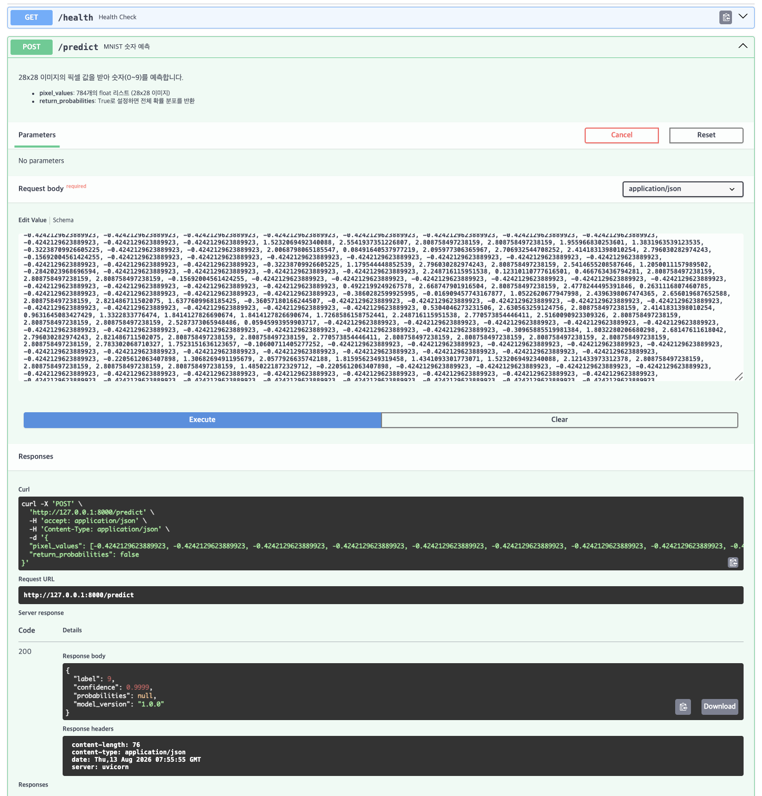

# model_serving_day2

작성일: 2026년 08월 13일(목)
---

# 섹션 5 수행 내역 캡쳐

---

### ✅ 체크포인트01

다음 질문에 답할 수 있다면, 이 섹션의 학습 목표를 달성한 것입니다:

1. FastAPI가 Flask보다 모델 배포에 적합한 이유 세 가지는 무엇입니까?
    1. Flask는 가볍교 유연한 범용 웹 서비스이며 동기식 처리 방식을 사용하고 있다. 반면 FastAPI는 비동기 처리 방식을 사용하며, 입력 데이터를 자동으로 검증하고(Pydantic), API 문저 자동 생성을 기본적으로 제공한다. 따라서 모델베포처럼 입력→처리→응답 구조의 서비스에 가장 적합하다. 
2. Uvicorn의 역할은 무엇이며, 왜 FastAPI와 함께 사용합니까?
    1. Uviconrn은 ASGI(Asynchronous Server Gateway Interface) 서버로, FastAPI와 같은 비동기 프레임워크가 파이썬 코드로 동작할 수 있도록 웹서버와 연결해주는 역할을 한다. FastAPI 자체에는 요청을 받는 기능이 없기 때문에 Uvicorn을 함께 사용해야한다. 
3. `@app.get("/health")`에서 `get`과 `"/health"`는 각각 무엇을 의미합니까?
    1. get은 HTTP 요청 형식이 GET 메서드 형식으로 온다는 것을 의미하고, /health는 해당 요청이 도달할 엔드포인트(URL 경로)를 의미한다. 
4. FastAPI에서 dict를 반환하면 어떤 일이 자동으로 일어납니까?
    1. 수동으로 JSON으로 변환할 필요 없이 자동으로 JSON 으로 변환된다. 

---

### ✅ 체크포인트02

다음 질문에 답할 수 있다면, 이 섹션의 학습 목표를 달성한 것입니다:

1. [`/models/sentiment-v1`](https://colab.research.google.com/drive/1IPZzmUOUilzN3EwDhogGzWeMX8P22XZv#)에서 `sentiment-v1`은 어떤 종류의 파라미터입니까?
    1. Path 파라미터. 전달 위치가 URL 경로 안에 위치하고 있다. 주로 모델 이름, 버전 등 리소스 식별에 사용된다. 
2. `/models?status=running&limit=5`에서 `status`와 `limit`은 어떤 종류의 파라미터입니까?
    1. Query 파라미터. URL의 ? 뒤에 사용되고, 두 파라미터는 &로 연결되어 있다. 필터링, 옵션, 페이지네이션 등에 사용된다. 
    2. 코드 관점에서는 다음과 같다. 
        1. **Path**: `@app.get("/models/{model_name}")` 과 같이 경로 데코레이션에 `{변수명}`으로 명시
        2. **Query**: 경로에 명시되지 않은 단순 타입(`int` , `str` 등)의 파라미터 
        3. **Body**: 단순 타입이 아닌 **Pydantic model(class)** 타입으로 파라미터를 선언하면 FastAPI가 알아서 Body로 인식한다. ****
3. 모델 추론 요청에 Request Body를 사용하는 이유는 무엇입니까?
    1. Request Body를 사용할 경우 HTTP 본문 안에 JSON 형태로 데이터를 입력해서 보낼 수 있다. 이 경우 입력 데이터가 복잡하거나 구조화 되어있어도 문제 없이 요청 가능하다. 또한 여러 필드를 전달 가능하고, 데이터의 양이 많아도 문제되지 않는다. 
4. FastAPI에서 함수의 파라미터가 Path, Query, Body 중 어디서 오는지 어떻게 판별합니까?
    1. URL 주소의 형태를 보고 판별 가능한다. URL 경로 안에 파라미터가 들어가 있다면 Path, ? 뒤에 있다면 Query, URL 경로 상에서 확인이 되지 않는다면 Body로 온 것이다. 

---

### ✅ 체크포인트03

다음 질문에 답할 수 있다면, 이 섹션의 학습 목표를 달성한 것입니다:

1. FastAPI에서 Swagger UI에 접속하려면 어떤 URL로 이동합니까?
    1. http://localhost:8000/docs
2. Swagger UI가 코드와 항상 동기화될 수 있는 이유는 무엇입니까?
    1. 개발자가 Pydantic 모델을 수정하면 문서도 자동으로 업데이트 된다. Swagger UI는 이 JSON Schema를 읽어 입력 폼을 자동으로 만들기 때문에 코드와 문서가 항상 동기화된다. 
3. Pydantic 모델의 `Field(description=, examples=)`는 Swagger UI의 어디에 반영됩니까?
    1. 해당 API 엔드포인트를 클릭해서 열었을 때 보이는 Request body의 예시 값(Example Value)영역에 반영되어 테스트할 때 확인할 수 있다. 
    또한 Schemas 섹션에서 각 클래스 별 객체들에 대한 description 및 examples 를 확인할 수 있다.
4. Swagger UI와 ReDoc의 핵심 차이는 무엇입니까?
    1. Swagger UI는 try it out 이라는 API 호출 기능이 있어 개발 중 바로 테스트를 할 수 있으므로 개발자에게 적합하다. ReDoc은 조회만 가능한 외부 공유형 문서이다. 외부, 즉 클라이언트에게 전달할때 적합하다. 

---

### ✅ 체크포인트04

다음 질문에 답할 수 있다면, 이 섹션의 학습 목표를 달성한 것입니다:

1. `text: str`과 `text: str = "기본값"`의 차이는 무엇입니까?
    1. 전자는 text에는 str 타입 데이터가 요구되며 반드시 입력되어야 하는 필수값임을 나타내고, 후자는 text 변수에는 str 타입의 데이터가 들어와야 하고 만약 아무런 데이터가 들어오지 않는다면 “기본값”이 입력된다는 것을 나타낸다. 
2. `Field(..., min_length=1, max_length=5000)`에서 `...`은 무엇을 의미합니까?
    1. 반드시 입력값이 들어와야 한다(필수값)는 의미이다. 
3. 422 에러 응답에서 `loc` 필드는 어떤 정보를 담고 있습니까?
    1. 에러가 어디에서 발생했는지에 대한 위치 정보를 담고 있다
4. `response_model`을 지정하면 어떤 이점이 있습니까?
    1. Swagger UI에 응답 스키마가 표시되고, 스키마에 정의되지 않은 필드는 응답에서 자동으로 제거된다. 내부 데이터가 실수로 클라이언트에게 노출되는 것을 막아준다. 

---

### ✅ 체크포인트05

다음 질문에 답할 수 있다면, Day 2의 학습 목표를 달성한 것입니다:

1. 모델을 서버 시작 시 한 번만 로드해야 하는 이유는 무엇입니까?
    1. 모델 로드는 파일 I/O이 포함된 무거운 작업이다. 요청시마다 모델 로드르 수행하게 되면 응답 시간이 수 초로 늘어나게 된다. 또한 모델은 메모리(RAM/VRAM)을 매우 많이 차지하므로 여러 번 로드를 하면 서버가 터질 수 있다. 따라서 서버 시작 시 한 번 로드해서 이미 로드된 모델을 계속 이용하는 것이 적합하다. 
2. pixel_values가 784개가 아닌 요청이 들어오면 어떤 일이 발생합니까? 이를 처리하는 코드를 직접 작성했습니까?
    1. 픽셀의 값 개수가 틀리거나, 숫자가 아닌 다른 타입의 데이터가 들어오거나 또는 값이 누락 될 경우 Pydantic이 pixel_values=784 조건에 따라 자동으로 거부하게된다. 단 서버가 죽지는 않고, 적절한 상태코드(422)와 함께 메세지를 반환한다. 
    사용자는 이를 처리하는 코드를 직접 작성할 필요 없이, Pydantic이 자동으로 판단하고 처리한다. 
3. HTTPException(status_code=503)은 어떤 상황에서 사용했습니까? 왜 500이 아니라 503입니까?
    1. status code 503 `Service Unavailable`은 “서버가 현재 요청을 처리할 준비가 되어있지 않다”는 의미로 모델이 로드되었는지를 확인하는 과정에서, 모델이 로드 되지 않았을 경우 사용되는 상태 코드이다. status code 500 `Internal Server Error` 는 “서버 내부에서 코드를 실행하다 예상치 못한 버그가 터졌다”는 의미로 추론 실행 과정에서 추론 실패시 사용된다.
4. Swagger UI에서 PredictRequest의 description과 examples가 어디에 표시됩니까
    1. 해당 API 엔드포인트를 클릭해서 열었을 때 보이는 Request body의 예시 값(Example Value)영역에 반영되어 테스트할 때 확인할 수 있다. 
    또한 Schemas 섹션에서 각 클래스 별 객체들에 대한 description 및 examples 를 확인할 수 있다.