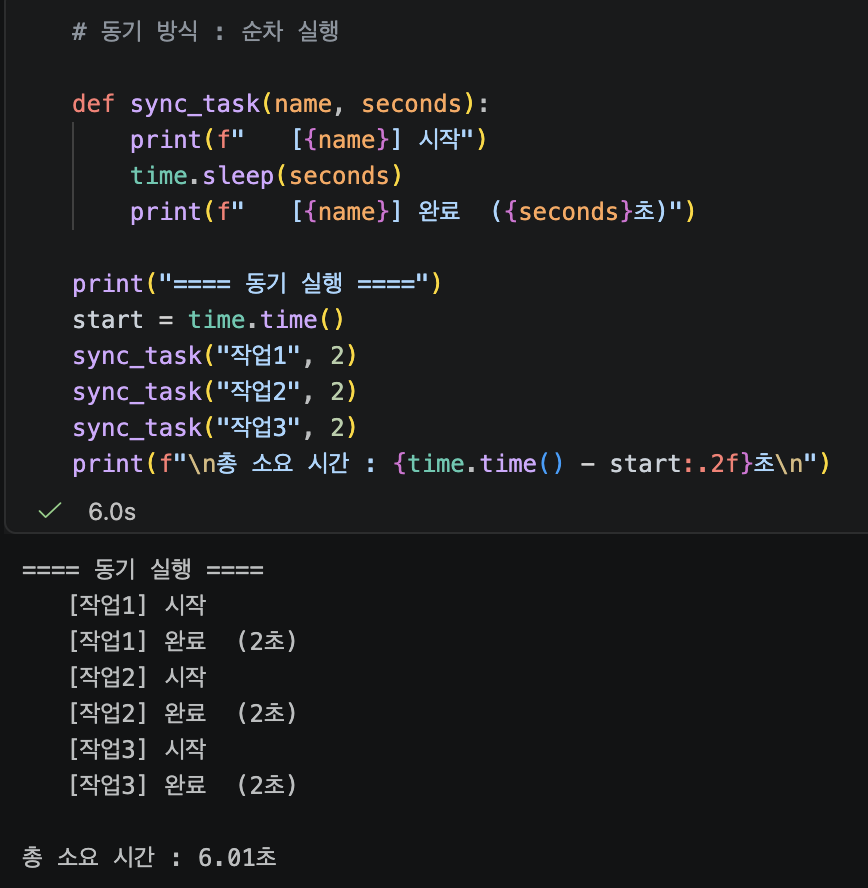
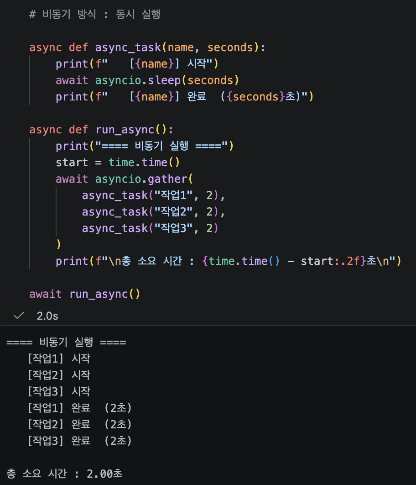
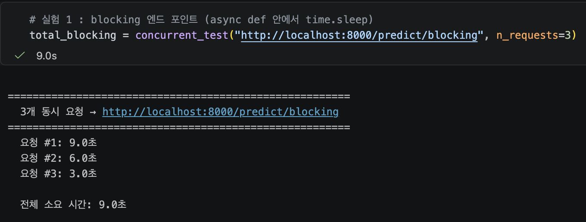

# model_serving_day3

작성일 : 2026.08.14

---

### 오늘 풀어야 하는 문제

```markdown
Day2에서 만든 API는 한 번에 하나의 요청만 처리 가능. 모델 추론에 3s이 걸린다면 10며의 사용자가 동시 요청시 마지막 사용자는 30s를 기다려야 한다. 

해결 방향  
	1. async/await의 원리를 이해한다 (섹션 2)  
	2. 문제를 직접 재현한다 (섹션 3)  
	3. run_in_executor로 해결한다 (섹션 4)  
	4. 에러 핸들링으로 안정성을 높인다 (섹션 5)  
	5. 개선 효과를 측정한다 (섹션 6)          
```

---

## 섹션 2 수행 내역





#### 결과 비교

```bash
동기: 2초 + 2초 + 2초 = 6초 (순차 실행)  
비동기: max(2초, 2초, 2초) = 2초 (동시 실행)
```

`await` 를 만나면 이벤트 루프는 대기를 등록하고 바로 다음 작업을 시작한다. 

→ 세 작업의 “시작”이 거의 동시에 출력된 것을 보면 확인할 수 있다. 

### ✅ 체크포인트02

1. `time.sleep(3)`과 `await asyncio.sleep(3)`의 핵심 차이는 무엇입니까?
    1. `time.sleep(3)`은 3s동안 해당 스레드 자체를 ‘수면(블로킹)’상태로 만든다. 문제는 FastAPI의 핵심 비동기 엔진(이벤트 루프)이 단일 스레드를 돌고 있기 때문에, 그 단일 스레드를 재워버리면 이벤트 루프 전체가 마비되어 다른 일을 처리 할 수 없다. `await asyncio.sleep(3)`은 “3초 후에 깨워줘”라고 등록 해놓고 다른 작업을 처리할 수 있다. 
2. 모델 추론처럼 CPU를 계속 사용하는 작업에서 `async/await`만으로 동시 처리가 안 되는 이유는 무엇입니까?
    1. CPU를 계속 사용하는 작업에서는 다른 일을 할 수 있는 “대기 시간”이 존재하지 않는다. 따라서 CPU가 대기하면서 응답을 기다리는 시간을 없애고, 대기 시간에도 일을 하게 만드는 `async/await` 만으로는 동시 처리가 불가능하다. 

---

## 섹션 3 수행 내역

### 실험 1



#### 결과 분석

```markdown
추론 시간은 3초인데 3명이 동시에 요청한 결과 :  
요청 #1 : 3초 (즉시 처리)
요청 #2 : 6초 (요청 #1이 끝날 때 까지 3초 대기 + 추론 3초)
요청 #3 : 9초 (요청 #1, #2가 끝날 때까지 6초 대기 + 추론 3초)

→ 완전한 순차 실행이다. 동시 처리가 전혀 이루어지지 않았다. 
⇒ async을 적용하더라도 그 안에 time.sleep()이 포함되면 세 요청이 3초/6초/9초로 하나씩 차례로 끝난다. 
```

### 실험 2


#### 결과 분석

```bash
일반 def를 수행할 결루 FastAPI가 자동으로 별로 스레드에서 실행한다. 
이벤트 루프는 브로킹되지 않지만, 스레드폴 크기에 제한이 있어 완벽한 해결책이 되지는 못한다. 
```

### 실험 3 **: blocking이 헬스체크까지 막는 현상**


#### ⚠️ blocking 버전에서는 헬스체크조차 대기한다.

이것이 실무에서 심각한 이유:

- 로드밸런서는 헬스체크로 서버 상태를 판단한다.
- 헬스체크가 응답하지 않으면 "서버 다운"으로 판단하여 트래픽을 차단한다.
- 실제로는 서버가 살아있는데, 추론 때문에 응답을 못 하는 것뿐인데, 결과적으로 정상 서버가 풀에서 빠지는 심각한 문제가 발생한다.

### ✅ 체크포인트03

1. `async def` 안에서 `time.sleep(3)`을 호출하면 왜 다른 요청까지 지연됩니까?
    1. time.sleep(3)을 호출하면 이벤트 루프가 3초간 완전히 멈추게 된다. 그 동안 다른 요청 처리가 불가능하기 때문에 다른 요청까지 모두 지연되게 된다. 
2. 일반 `def`로 선언된 엔드포인트는 FastAPI가 내부적으로 어떻게 처리합니까?
    1. FastAPI가 별도의 스레드풀(ThreadPoolExecutor)에서 실행한다. 따라서 이벤트 루프는 자유롭게 다른 요청을 처리 가능하다. 다만 기본 스레드풀 크기가 제한적이고, 스레드풀의 크기, 실행 방식을 직접 제어할 수 없다. 
3. blocking 추론 중 헬스체크까지 막히면 실무에서 어떤 문제가 발생할 수 있습니까?
    1. 로드밸런서는 헬스체크로 서버 생태를 판단한다. 따라서 blocking 추론 중 헬스 체크가 응답하지 않으면 “서버 다운”으로 판단하고 트래픽을 차단시킨다. 즉, 실제로 서버는 살아있는데도 불구하고 정상 서버가 풀에서 빠지는 심각한 문제가 발생한다. 

---

## 섹션 4 수행 내역

### 실험 1


### 실험 2


### 실험 3


---

### Day2 에 작성한 main.py에 적용


```bash
Day 2 (app/main.py)                       Day 3 (app/main_v2.py)
──────────────────                        ──────────────────────

def predict_from_pixels(...):             async def predict_from_pixels(...):
    ...                                       ...
    result = predict(model, tensor)           result = await loop.run_in_executor(
    ...                                           inference_executor,
                                                  run_inference,
                                                  tensor,
                                              )
                                              ...

변경: 2줄                                   추가: inference_executor, run_inference
```

### ThreadPool size guide

```bash
CPU 추론 (GPU 없음):
  - CPU 코어 수와 비슷하게 설정.
  - 예: 4코어 → max_workers=4
  - 너무 많으면 컨텍스트 스위칭 오버헤드가 발생.

GPU 추론:
  - GPU 메모리 제한이 있으므로 1~2로 설정.
  - GPU는 내부적으로 병렬 처리하므로, 스레드를 늘려도 속도 향상이 크지 않다.
```

#### 🛠️ 상황별 비동기 패턴 선택 가이드

| Q: CPU 바운드 작업(모델 추론 등)이 있는가? | 프로젝트 규모 | 권장 패턴 및 방법 | 예시 상황 |
| --- | --- | --- | --- |
| **없다 (I/O 위주)** | - | `async def` + `await` | DB 조회, 외부 API 호출, 파일 읽기/쓰기 |
| **있다 (CPU 바운드)** | 간단함 | **일반 `def` 사용** *(가장 쉬움)* | 간단한 전처리, 작은 모델 추론 |
| **있다 (CPU 바운드)** | 복잡함 / 대규모 | `async def` + `run_in_executor` | 고성능 모델 추론, 추론 전후 복잡한 I/O 연산 |

### ✅ 체크포인트04

1. `run_in_executor`가 이벤트 루프 블로킹을 방지하는 원리는 무엇입니까?
    1. 동기 함수를 별도의 스레드(또는 프로세스)에서 실행하고, 그 결과를 비동기적으로 기다린다.
2. `run_in_executor`의 첫 번째 인자에 `None`을 넣으면 어떤 스레드풀이 사용됩니까?
    1. None 을 넣으면 기본(`asyncio` 내장) 스레드풀이 사용된다.
3. 일반 `def`와 `async def + run_in_executor`의 핵심 차이는 무엇입니까?
    1. 일반 `def`를 사용할 경우 FastAPI가 알아서 별도의 스레프풀에서 실행한다. 다만 기본 스레드풀 크기가 제한적이고, 스레프풀의 크기 및 실행 방식을 직접 제어할 수 없다. 또한 다른 엔드포인트와 스레드폴을 공유한다. 
    2. `async def + run_in_executor`  방식은 추론 전용 스레드풀을 직접 만들어서 사용하며 크기를 제어 할 수 있다(max_worker=4). 따라서 추론의 부하가 다른 엔드포인트에 영향을 주지 않는다. 
    3. 따라서 간단한 프로젝트에서는 일단 `def` 로 충분하지만, 추론 전용 스레드풀을 분리하고 싶다면 `run_in_executor` 를 사용해야 한다. 
4. GPU 추론 시 스레드풀 크기를 1~2로 제한하는 이유는 무엇입니까?
    1. GPU는 메모리 제한이 있으므로 1~2로 제한하는 것이 적합하다. GPU는 내부에서 병렬적으로 처리하기 때문에 스레드를 늘려도 속도 향상이 크지 않다. 

---

## 섹션 5 수행 내역


#### 로그 레벨 의미 :

```markdown
INFO     → 정상 동작 기록 (서버 시작, 모델 로드 등)
WARNING  → 주의가 필요한 상황 (메모리 부족 임박 등)
ERROR    → 에러 발생 (추론 실패 등)
CRITICAL → 심각한 에러 (서버 다운 위험)
```

### ✅ 체크포인트05

1. 글로벌 Exception Handler를 사용하면 어떤 반복을 줄일 수 있습니까?
    1. 엔드포인트 마다 try-except를 반복하는 대신에 글로벌 Exception handler를 사용함으로써 모든 예외를 중앙에서 처리할 수 있다. 
2. 클라이언트에게 스택 트레이스를 노출하면 안 되는 이유는 무엇입니까?
    1. 스택 트레이스란 예외 발생 과정에서 호출된 메서드들의 순서와 위치 정보를 의미한다. 예외가 발생한 지점부터 호출 스택의 상위 메서드들까지의 정보를 담고 있기에 예외가 발생한 원인을 추적하고 디버깅하는데는 유용하다. 
    2. 다만 스택 트레이스를 클라이언트에게 노출하게 될 경우, 해당 서비스의 구조를 노출하게 되고 보안의 위험이 생긴다. 따라서 에러가 발생했을 때는 서버 로그에 상세 정보를 기록하고, 클라이언트에게는 안전한 메세지만을 반환해야 한다. 
3. `logging` 모듈이 `print()`보다 나은 점은 무엇입니까?
    1. logging.error(”에러 발생”) 의 경우 에러 발생 시간, 심각도, 모듈명 등이 자동으로 포함되며 파일로 저장이 가능하다. 반면 print(”에러 발생”)의 경우 시간 정보도, 심각도 구분도 없으며 파일로 저장도 불가능하다.  

---

## 섹션 6 수행 내역

### 실험 1 : 동시 요청 테스트


### 실험 2 : 에러 핸들링 동작 확인


모든 비정상 요청이 서버를 죽이지 않고, 적절한 상태 코드와 메세지를 반환함을 확인할 수 있다 

### 프로젝트 구조

```markdown
model-serving-course/
├── 📁 app/
│   ├── error_handlers.py          ← Day 3: 글로벌 에러 핸들러
│   ├── logger_config.py           ← Day 3: 로깅 설정
│   ├── main_final.py              ← Day 3: 최종 서버
│   ├── middleware.py              ← Day 3: 요청/응답 로깅 미들웨어
│   ├── model_utils.py             ← Day 1: 모델 유틸리티
│   └── schemas.py                 ← Day 2: Pydantic 스키마
├── 📁 models/
│   └── mnist_state_dict.pth
├── .gitignore
└── requirements.txt
```

### ✅ Day 3 최종 체크포인트

```
Q1. 동기 서버에서 3초 걸리는 추론을 3명이 동시에 요청하면 총 몇 초 걸립니까?
	- 동기 서버는 요청을 순차적으로 처리하며 이전 요청이 완료될 때 까지 대기하는 시간이 생긴다. 따라서 3초 걸리는 추론을 3명이 동시에 요청하면 총 9초가 걸린다. 
Q2. time.sleep(3)과 await asyncio.sleep(3)의 핵심 차이는?
	- 전자는 해당 스레드 자체를 3초간 수면(블로킹)상태로 만든다. 해당 스레드에서는 수면 시간 동안에는 다른 일을 할 수 없게 된다. 후자의 경우 "3초 뒤에 깨워줘"라고 등록하고 그 사이에 다른 일을 수행할 수 있다. 
Q3. async def 안에서 동기 블로킹 코드를 실행하면 왜 헬스체크까지 영향받습니까?
	로드밸런서는 헬스체크를 통해 서버 상태를 파악한다. FastAPI의 async def 엔드포인트는 단일 스레드인 메인 이벤트 루프에서 실행되는데, 동기 블로킹 코드가 메인 스레드를 멈추게 만들면 이벤트 루프 전체가 마비되어 동시에 들어온 헬스케츠 요청(/health)를 아예 처리(수신)하지 못하게 된다. 로드밸런서는 이를 "서버 다운"으로 판단하고 트래픽을 차단하게 된다. 즉, 실제로 서버가 살아있음에도 불구하고 정상 서버가 풀에서 빠지는 문제가 발생한다. 
Q4. run_in_executor가 이벤트 루프 블로킹을 방지하는 원리는?
	run_in_executor는 동기 함수를 다른 스레드(또는 프로세스)에서 실행하고 그 결과를 비동기적으로 기다린다.
Q5. 글로벌 Exception Handler를 사용하는 이유는?
	글로벌 Exception Handler를 사용하게 되면 엔드 포인트마다 생길 수 있는 예외들을 중앙에서 한번에 처리할 수 있다. 이 경우 엔드포인트마다 try-except 구분을 반복할 필요가 없고, 코드의 재활용성 수정의 용이성이 높아진다. 또한 API 전체에 일관된 에러 응답 포맷(JSON 형태 등)을 강제할 수 있다.
Q6. 클라이언트에게 스택 트레이스를 노출하면 안 되는 이유는?
	스택 트레이스는 예외 발생 과정에서 호출된 메서드들의 순서와 위치정보를 의미한다. 예외가 발생한 지점부터 호출 스택의 상위 메서드들까지의 정보를 담고 있기에 예외가 발생한 원인을 추적하고 디버깅하는데는 유용하다. 다만 스택 트레이스를 클라이언트에게 노출하게 될 경우, 해당 서비스의 구조를 노출하게 되고 보안의 위험이 생긴다. 따라서 에러가 발생했을 때는 서버 로그에 상세 정보를 기록하고, 클라이언트에게는 안전한 메세지만을 반환해야 한다.
```