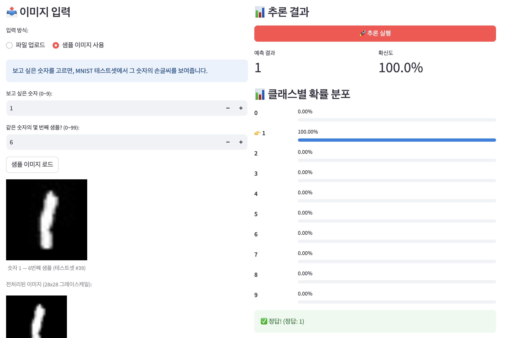
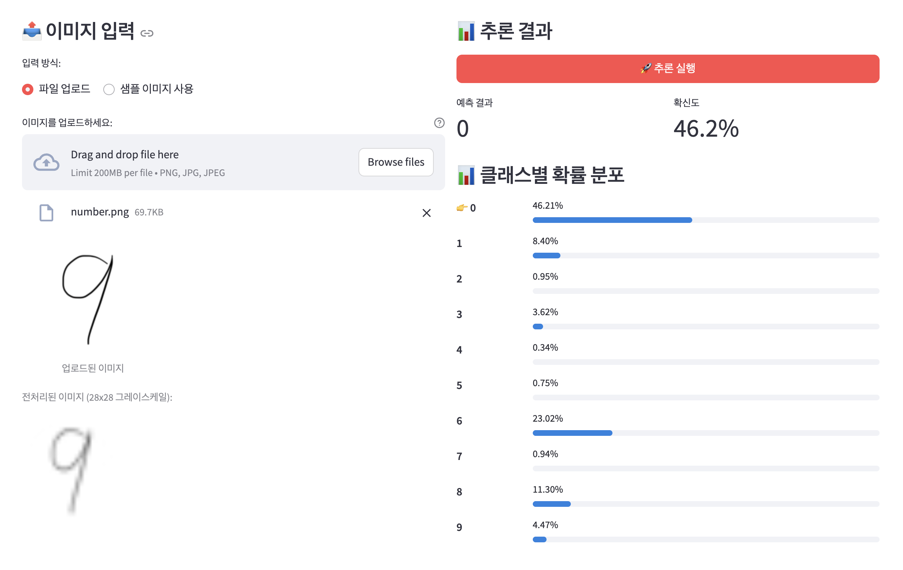
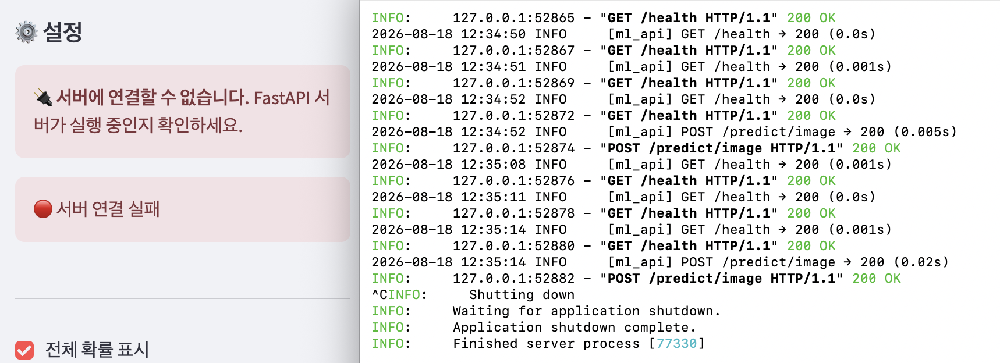
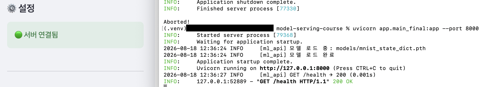
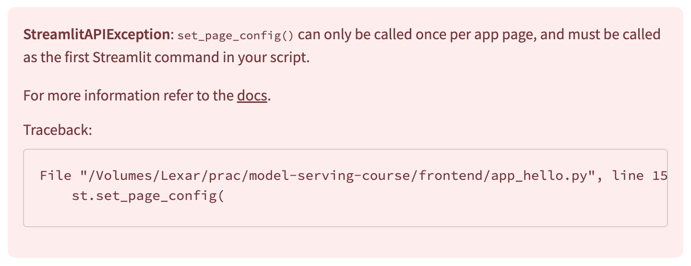

# model_serving_day4

작성일 : 2026년 8월 18일

---

# 섹션 5 수행내역 캡쳐

### 테스트 1 기본 흐름



### 테스트 2 파일 업로드



3 epoch만 학습되어 일은 잘 못하지만, Streamlit으로 만든 front 페이지는 잘 동작한다. 

### 테스트3 에러 상황



벡엔드 서버 종료시 사이트바 상태가 🔴로 변하면서 “서버에 연결할 수 없습니다”라는 문구가 함께 표시된다.



unicorn app.main_fianl:app —port 8000 을 터미널에서 재실행하면 벡엔드 서버가 살아나면서 서버에 연결된 것을 확인할 수 있다.

---

### ✅ 체크포인트01

1. Streamlit의 스크립트 재실행 모델이란 무엇입니까?
    1. 일반적인 웹 프레임워크는 서버가 시작되고 사용자 이벤트(클릭, 입력 등)가 작동하면 해당 이벤트 핸들러만 실행되지만, Streamlit의 경우 사용자 이벤트가 작동하면 스크립트 전체를 위에서 아래로 다시 실행한다. 
    즉, 즉 사용자가 버튼을 누를 때 마다 파이썬 스크립트가 처음부터 끝까지 다시 실행되는 모델이다. 
2. `st.text_input()`에 값을 입력하면 내부적으로 어떤 일이 일어납니까?
    1. 입력값이 들어오면 스크립트가 재실행 되면서 st.text_input() 이 할당된 변수에 새 값이 들어간다. 
3. `st.set_page_config()`를 스크립트 중간에 호출하면 어떻게 됩니까?
    1.  `st.set_page_config()` 가 스크립트 내의 가장 첫번째 Streamlit 명령어가 아닐 경우 무조건 에러(`StreamlitAPIException`)이 발생한다. 
    
    
    

---

### ✅ 체크포인트02

1. `st.file_uploader()`로 업로드된 파일의 바이트 데이터는 어떻게 얻습니까?
    1. Streamlit의 파일 업로더는 파이썬 표준 `BytesIO` 와 유사한 객체를 반환 하므로, 메모리에서 직접 바이트를 읽을 수 있다.
    2. `st.file_uploader()` 로 업로드된 파일 객체에서 `.getvalue()`  또는 `.read()`  메서드를 호출하면 바이트 데이터를 바로 얻을 수 있다. 
    
    **예시:** 
    
    ```bash
    upload_file = st.file_uploader("파일을 선택하세요")
    
    if upload_file is not None:
    	st.success("파일이 성공적으로 업로드되었습니다.")
    	bytes_data = upload_file.getvalue()
    	# 또는 표준 파이썬 방식 사용 
    	# bytes_date = upload_file.read()
    	
    	st.write(f"파일 이름: {upload_file.name}")
    	st.write(f"데이터 타입: {type(bytes_data)}")
    ```
    
    
    
2. Streamlit에서 `@st.cache_resource`를 사용하는 이유는 무엇입니까?
    1. Streamlit은 이벤트마다 스크립트를 재실행한다. 매번 재실행할 때 마다 객체를 새로 생성한다면 느려지므로, 한 번만 생성하고 재사용할 캐시가 필요하다. `@st.cache_resource` 를 사용하면 스크립트가 몇 번 재실행되든 같은 객체를 사용할 수 있다. 

---

### ✅ 체크포인트03

1. 모놀리식과 분리 아키텍처의 핵심 차이를 한 문장으로 설명하세요.
    1. 모놀리식은 Streamlit 안에서 직접 추론을 하고, 분리 아키텍처는 UI(Frontend)와 추론로직(Backend)가 완전히 분리되어 있다. 
2. 모델을 업데이트할 때, 분리 아키텍처에서는 어떤 서버만 재배포하면 됩니까?
    1. 모델 로드를 담당하는 것은 FastAPI 서버이므로 FastAPI 서버만 재배포 하면 된다. 
3. Streamlit 앱에 PyTorch가 설치되어 있지 않아도 되는 이유는 무엇입니까?
    1. Streamlit은 사용자가 입력한 값을 FastAPI로 전달하고, 해당 값으로 FastAPI 에서 추론을 수행하여 도출한 응답을 전달받아 결과를 시각화하여 보여주는 역할을 한다. 즉, Streamlit은 HTTP요청을 보내고 JSON응답을 받아 화면에 뿌려줄 뿐이다. 

---

### ✅ 체크포인트04

1. 이미지를 API에 전송할 때 Base64로 인코딩하는 이유는 무엇입니까?
    1. Base64는 데이터를 64진법으로 나타낸것으로, A-Z, a-z, 0-9, /+ 만을 사용하기 때문에 문자 포맷이 달라 데이터를 손상시킬 수 있는 시스템 간에 안정적으로 전송할 수 있다. 
    2. **API 통신에 주로 사용되는 JSON 형식은 텍스트 기반이므로 바이너리 데이터(원시 이미지 데이터)를 직접 담을 수 없다.** Base64 인코딩을 통해 바이너리를 안전한 ASCII 텍스트로 변환해야만 JSON 안에 데이터를 실어서 보낼 수 있습니다. 
2. `response.raise_for_status()`는 어떤 역할을 합니까?
    1. `response.raise_for_status()` 는 HTTP 응답 코드가 성공(2xx)이 아닌 실패(4xx 클라이언트 에러, 5xx 서버 에러)일 경우 파이썬 `HTTPError` 예외(Exception)를 발생시켜 주는 메서드이다. 
    2. 매 요청때마다 응답의 상태 코드를 일일이 체크하고 핸들리하는 대신에 response의 raise_for_status()를 사용하여 응답의 상태코드를 확인하고 쉽게 핸들링 할 수 있다. 

---

### ✅ Day 4 최종 체크포인트

```
[섹션 1: Streamlit 소개]
Q1. Streamlit의 스크립트 재실행 모델이란?
- Streamlit의 경우 일반적인 웹 프레임워크(서버시작→사용자 이벤트→해당 이벤트 핸들러 실행)와 달리 사용자 이벤트 작동 시 
파이썬의 스크립트 전체를 위에서 아래로 새로 읽어들인다. 
	
[섹션 2: 핵심 컨셉]
Q2. @st.cache_resource를 사용하는 이유는?
- Streamlit의 스크립트 재실행 모델 특성 상, 이벤트마다 스크립트를 재실행한다. 매번 재실행 할 때마다 객체를 
새로 생성한다면 느려지므로, 한 번만 생성하고 재사용할 캐시가 필요하다. @st.cache_resource 를 사용하면 스크립트가 
몇 번 재실행되든 같은 객체를 사용할 수 있다. 

[섹션 3: System Architecture]
Q3. 프론트엔드와 백엔드를 분리하는 핵심 이유 두 가지는?
(1) 분리 아키텍쳐를 사용 할 경우, 독립적인 개발, 배포, 확장이 가능하다. 모델을 업데이트 한다면 FastAPI(백엔드) 서버만 
재배포하고, UI를 변경한다면 Streamlit(프론트엔드) 앱만 재배포 하면 된다. 또한 사용자가 늘어나서 추론 부하가 높아진다면
 FastAPI를 추가 배포하는 등의 대처가 가능하다.
(2) FastAPI 서버가 독립적으로 존재할 경우, 하나의 API로 여러 클라이언트를 지원할 수 있다. (Streamlit은 
여러 클라이언트 중 하나) 
Q4. Streamlit 앱에 PyTorch가 필요 없는 이유는?
- 사용자가 이미지를 업로드 하였을 때 전체 통신 흐름을 살펴보면, Streamlit이 사용자 업로드한 파일을 수신하고 해당 이미지를
 Base64로 변환한다. 이를 HTTP통신으로 FastAPI 엔드포인트로 전달한다. FastAPI에서는 전달받은 값으로 추론을 수행하고
 JSON 응답을 다시 Streamlit에 전달한다. Streamlit은 전달받은 응답을 시각화하여 사용자에게 전달한다. 즉, Streamlit은
 HTTP요청을 보내고 JSON응답을 받을 뿐 모델 추론과는 관련이 없으므로 PyTorch가 필요하지 않다. 

[섹션 4: API 호출]
Q5. API 호출 실패 시 사용자에게 스택 트레이스가 아닌 메시지를 보여줘야 하는이유는?
- 스택 트레이스는 에러가 발생한 위치와 더불어 에러 발생 위치의 상위 클래스들까지 다 확인할 수 있게 하므로 디버깅하는데는 
좋지만 이 내용들이 사용자에게 그대로 노출 될 경우 보안 측면에서 심각한 문제를 야기할 수 있다. 
또한 비전공자 사용자의 경우 스택 트레이스 내용으로는 무엇이 문제인지 판한다기 어렵다. 따라서 스택 트레이스를 보여주는 대신
 response.raise_for_status()를 활용하여 에러 종류에 맞춰서 메세지를 전달하는 것이 보다 적합하다. 

[섹션 5: 실습]
Q6. st.session_state에 결과를 저장하는 이유는?
- 재 실행시 결과를 유지하기 위해서 st.session_state["last_result"]와 같이 저장한다. 
Q7. 이미지를 API로 전달할 때 Base64 인코딩이 필요한 이유는?
- API 통신에 주로 사용되는 JSON 형식은 텍스트 기반이므로 바이너리 데이터(원시 이미지 데이터)를 직접 담을 수 없다. 
따라서 Base64 인코딩을 통해 바이너리를 안전한 ASCII 텍스트로 변환해야만 JSON 안에 데이터를 실어서 보낼 수 있다. 
```