# AIFFEL Campus Online Code Peer Review Templete
- 코더 : 이다겸
- 리뷰어 : 서한호


# PRT(Peer Review Template)
- [x]  **1. 주어진 문제를 해결하는 완성된 코드가 제출되었나요?**
    - 문제에서 요구하는 최종 결과물이 첨부되었는지 확인
        - 중요! 해당 조건을 만족하는 부분을 캡쳐해 근거로 첨부
노트북에 EDA, 전처리, PyTorch MLP, LightGBM 비교, FastAPI, Streamlit, 통합 테스트가 모두 구현되어 있습니다.  
이미지 1.png, 3.png, 4.png, 5.png에서 서버 연결 상태와 입력값에 따른 예측 결과 변화를 확인했습니다.  
2.png에서 Swagger 문서의 /health, /predict 엔드포인트도 확인됩니다.  
error_1.png, error_2.png은 FastAPI 서버 중단 시 프론트엔드가 연결 실패를 표시하고, 재시작 뒤 연결이 복구되는 과정을 보여 줍니다.  
  
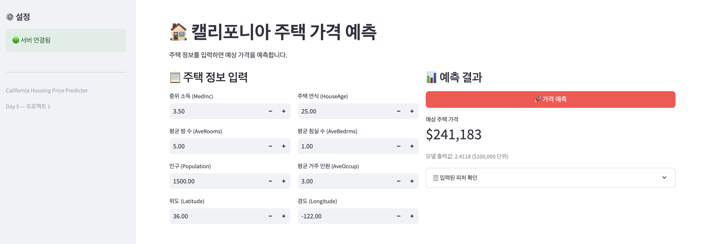  
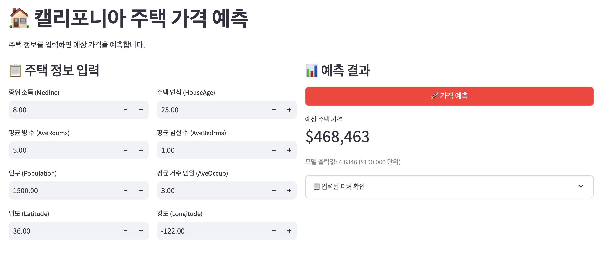  
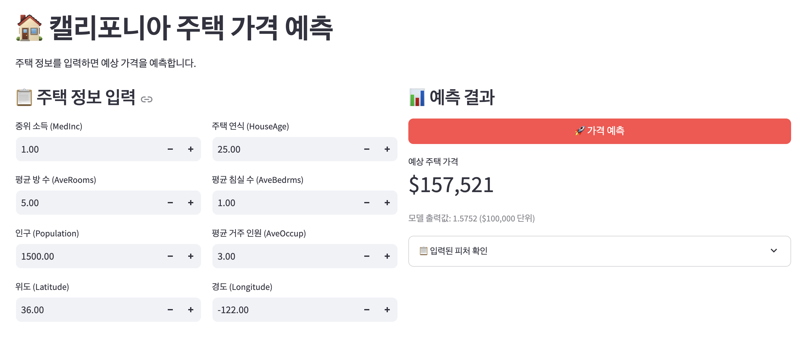  
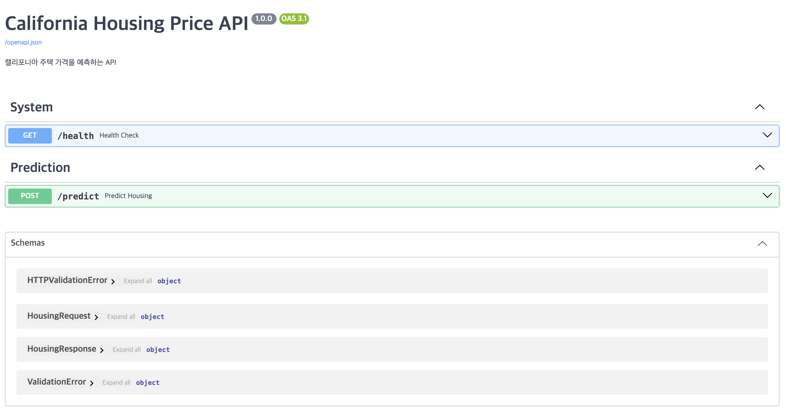  

  
    
- [x]  **2. 전체 코드에서 가장 핵심적이거나 가장 복잡하고 이해하기 어려운 부분에 작성된 
주석 또는 doc string을 보고 해당 코드가 잘 이해되었나요?**
    - 해당 코드 블럭을 왜 핵심적이라고 생각하는지 확인
    - 해당 코드 블럭에 doc string/annotation이 달려 있는지 확인
    - 해당 코드의 기능, 존재 이유, 작동 원리 등을 기술했는지 확인
    - 주석을 보고 코드 이해가 잘 되었는지 확인
        - 중요! 잘 작성되었다고 생각되는 부분을 캡쳐해 근거로 첨부  
EDA에서 발견한 극단값을 UI·Pydantic의 입력 제한과 같은 기준으로 제거한 이유가 Section 2.1.1에 잘 설명되어 있습니다.  
LightGBM 서빙 모듈에서 로그 변환 → 피처 순서 정렬 → 정규화 → 예측으로 이어지는 단계별 주석이 명확합니다.  
BatchNorm이 있는 MLP에서 추론 시 eval()이 필요한 이유도 잘 기록되어 있습니다.  
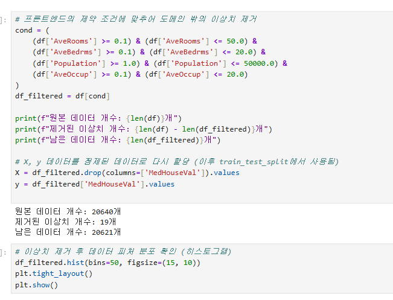  
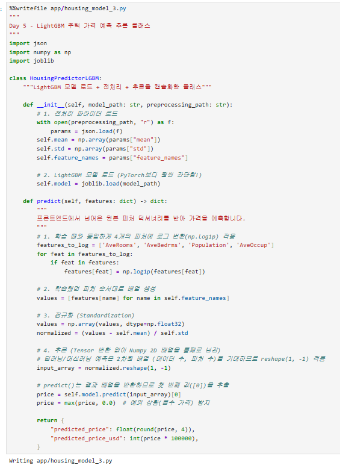  

        
- [x]  **3. 에러가 난 부분을 디버깅하여 문제를 해결한 기록을 남겼거나
새로운 시도 또는 추가 실험을 수행해봤나요?**
    - 문제 원인 및 해결 과정을 잘 기록하였는지 확인
    - 프로젝트 평가 기준에 더해 추가적으로 수행한 나만의 시도, 
    실험이 기록되어 있는지 확인
        - 중요! 잘 작성되었다고 생각되는 부분을 캡쳐해 근거로 첨부  
MLP의 구조 확장, BatchNorm, Dropout, Scheduler, 이상치 제거, 로그 변환을 적용해 성능 개선을 실험했습니다.  
이어서 MLP와 LightGBM을 동일한 정제 데이터에서 비교하고, 특정 샘플의 실패 사례까지 분석한 점이 좋습니다.  
서버 중단과 재시작을 실제 화면으로 검증한 점도 서비스 관점의 추가 실험으로 평가할 수 있습니다.  
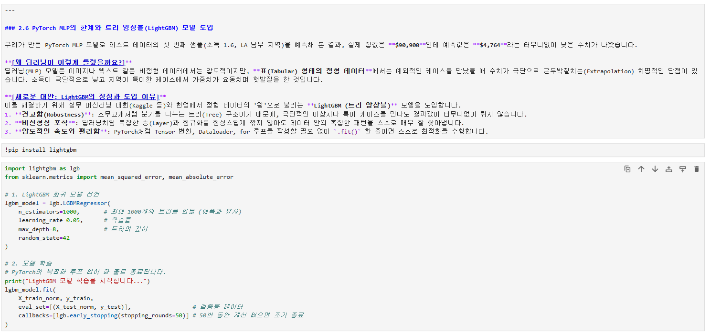
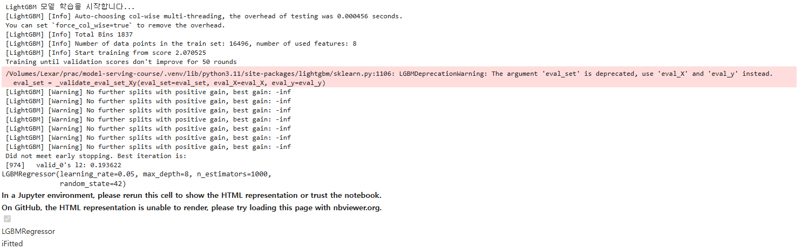
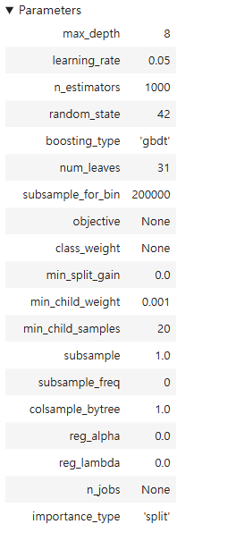
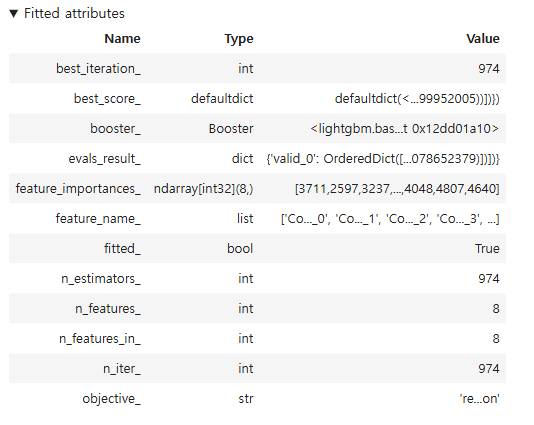
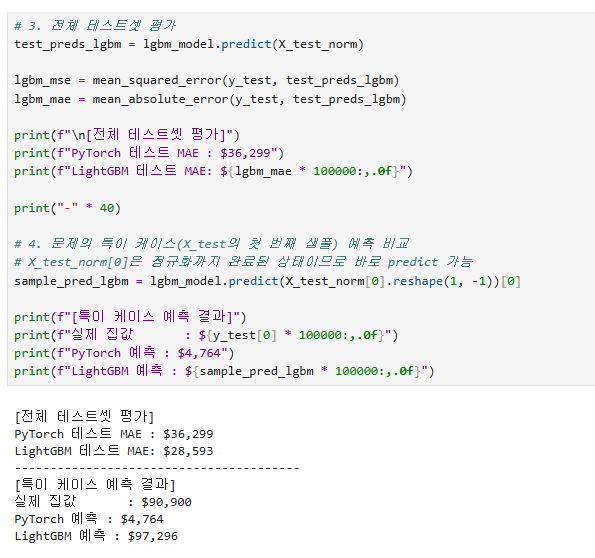  

        
- [x]  **4. 회고를 잘 작성했나요?**
    - 주어진 문제를 해결하는 완성된 코드 내지 프로젝트 결과물에 대해
    배운점과 아쉬운점, 느낀점 등이 기록되어 있는지 확인
    - 전체 코드 실행 플로우를 그래프로 그려서 이해를 돕고 있는지 확인
        - 중요! 잘 작성되었다고 생각되는 부분을 캡쳐해 근거로 첨부  
모델 선택, EDA, 서비스 구성에 관한 회고 내용은 충실합니다.
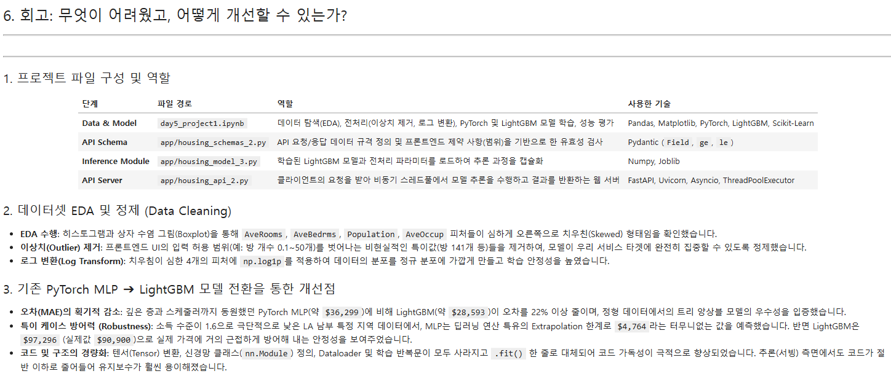  
        
- [x]  **5. 코드가 간결하고 효율적인가요?**
    - 파이썬 스타일 가이드 (PEP8) 를 준수하였는지 확인
    - 코드 중복을 최소화하고 범용적으로 사용할 수 있도록 함수화/모듈화했는지 확인
        - 중요! 잘 작성되었다고 생각되는 부분을 캡쳐해 근거로 첨부  
API 스키마, 모델 추론, API 서버, 프론트엔드가 모듈로 분리된 점은 좋습니다.  
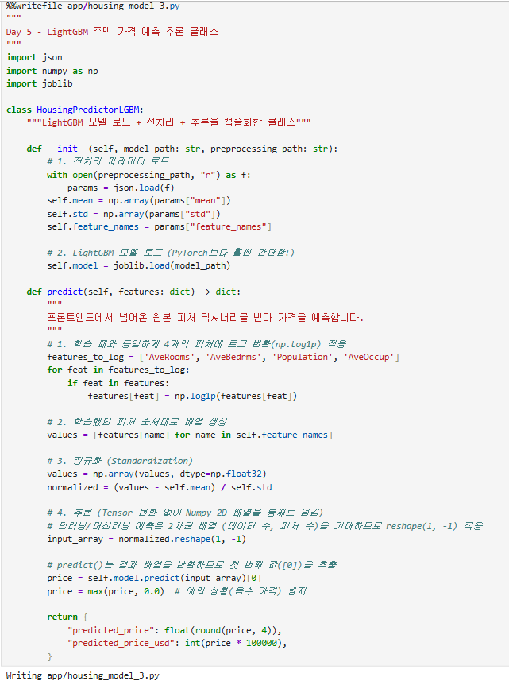  

# 회고(참고 링크 및 코드 개선)
```
EDA 기반 이상치 제거의 방향은 좋았습니다. UI와 Pydantic에서 허용하는 범위를 학습 데이터 정제에도 적용해, 서비스에서 들어올 수 없는 입력을 학습시키지 않도록 했습니다.  
실제로 20,640개 중 19개만 제거했으므로 무리하게 데이터를 버린 방식도 아닙니다.  
로그 변환 후 MLP의 MAE가 $36,299, LightGBM의 MAE가 $28,593으로 개선된 결과는 의미 있습니다.  
동일한 정제·로그 변환 데이터 기준에서 약 22% 낮은 MAE를 얻었고, 사례 데이터에서도 LightGBM이 실제값 $90,900에 가까운 $97,296을 예측했습니다.  
정형 데이터에서는 LightGBM 같은 트리 앙상블을 강력한 베이스라인으로 고려해야 한다는 결론은 타당했습니다.  
EDA 결과를 UI와 API 검증 규칙까지 연결한 점이 이 프로젝트의 가장 큰 장점입니다. 단순히 높은 성능을 목표로 하기보다,  
실제 서비스에서 받을 입력 범위를 정의하고 학습 데이터에도 반영했다는 점이 좋았습니다.  
또한 MLP를 무조건 고도화하는 데 그치지 않고, 정형 데이터에 적합한 LightGBM으로 비교 실험을 확장해 MAE를 약 22% 개선한 과정이 인상적이었습니다.  
다음 단계에서는 독립된 검증셋과 테스트셋으로 성능을 다시 평가하고, 전처리 규칙을 하나의 공통 모듈로 분리하면 재현성과 유지보수성이 더 좋아질 것입니다.  
```