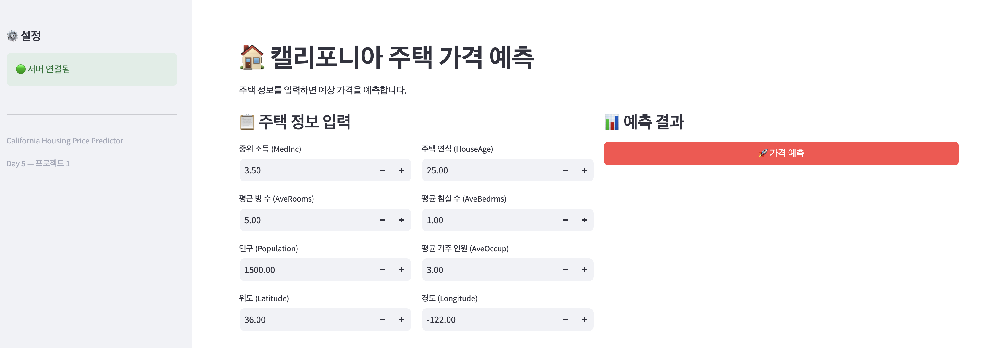
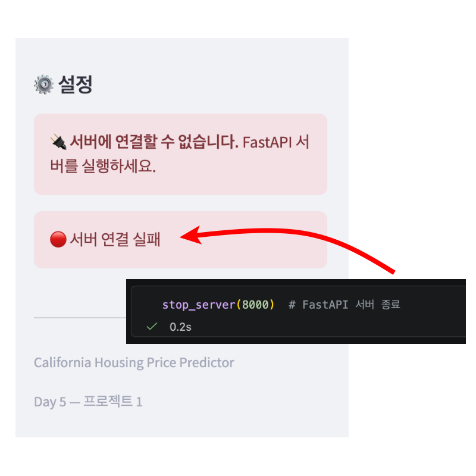
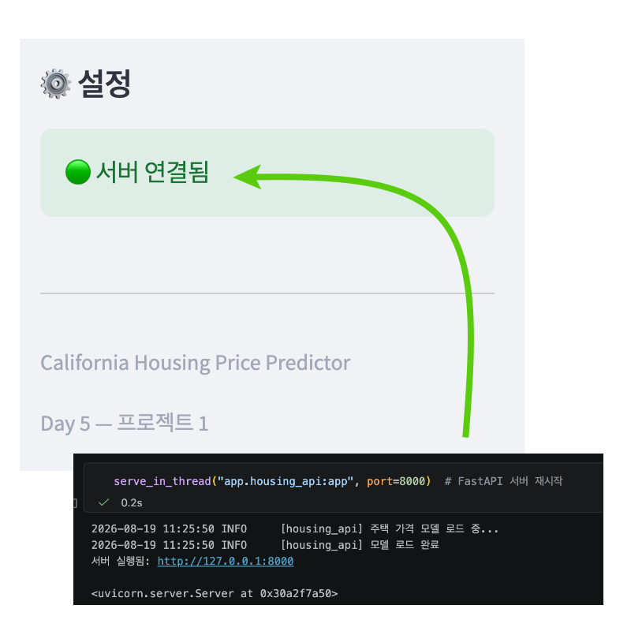

# model_serving_day5

작성일: 2026년 8월 19일

---

## 섹션 4: 테스트 시나리오




### 테스트 1 : 기본 흐름


- 사이드 바 서버 상태 : 연결 양호
- 기본값 그대로 가격 예측 클릭 : 예상 가격 표시 완료

### 테스트 2: 값 변경


- 중위 소득 8.0로 올리고 가격 예측 : 가격 상승
- 중위 소득 1.0로 내리고 가격 예측 : 가격 하락

### 테스트 3 : 에러 상황





- 벡엔드 서버 종료 (stop_server(8000) : 사이드바 상태 변화
- serve_in_thread(”app.housing_api:app”, port=8000) : 서버 재연결

---

### ✅ 체크포인트01

1. 이 프로젝트의 입력과 출력은 각각 무엇입니까?
    1. 입력을 8개의 피처(숫자)이고 출력은 중위 주택 가격(단위 $100,000)이다. 
2. MNIST 프로젝트와 비교했을 때, 데이터 형태가 어떻게 다릅니까?
    1. MNIST 프로젝트는 이미지 분류이고, `California Housing` 데이터셋을 이용한 이번 프로젝트의 데이터는 정형 데이터로 task는 회귀(regression)이다. 
3. 오늘 새로 만들 파일 3개의 이름과 역할을 말할 수 있습니까?
    1. housing_model.py : 주택 가격 모델의 정의하고 추론 함수를 포함
    2. housing_schemas.py : 주택 가격 API 스키마
    3. housing_api.py : 주택 가격 FaseAPI 서버 
    4. app_housing.py : 주택 가격 Streamlit 대시보드 
    5. housing_model.pth : 주택 가격 모델 가중치 

---

### ✅ 체크포인트02

1. 정규화에서 학습 데이터의 통계를 테스트 데이터에도 사용하는 이유는 무엇입니까?
    1. 테스트 데이터는 “실제 배포 환경에서 들어올 새로운 데이터”를 시뮬레이션하는 것이다. 새로운 데이터의 경우 통계를 미리 알 수 없으므로 대신 학습 데이터의 통계를 사용한다. 따라서 학습 데이터를 통해 도출한 평균(mean)/표준편차(std) 값은 배포 시에도 함께 저장해야 한다
2. 모델 가중치 외에 **함께 저장해야 하는 것**은 무엇이고, 왜 필요합니까?
    1. 학습 데이터를 통해 도출한 평균(train_mean)과 표준편차(train_std) 값을 배포시 함께 저장해야 한다. 저장하지 않을 경우 배포 환경에서 정규화를 할 수 없어 잘못된 예측이 나오게 된다. 
3. `HousingPredictor.predict()`에서 피처를 `self.feature_names` 순서로 배열하는 이유는?
    1. API를 통해 전달받는 데이터는 보통 JSON 포맷이며 파이썬에서는 딕셔너리로 처리된다. API 호출자가 데이터를 아무 순서로 섞어서 보내더라도 모델 추론이 어긋나지 않으려면, 모델이 학습할 때 사용한 리스트(`self.feature_names`) 순서대로 명시적으로 값을 추출(Mapping)하는 과정이 필수적이다. 

---

### ✅ 체크포인트03

1. `HousingRequest`에서 `Latitude`에 `ge=32, le=42` 제한을 넣은 이유는?
    1. 모델이 학습하지 않은 범위의 데이터가 들어오는 것을 OOD(Out-of-Distribution, 분포 외 데이터)라고 한다. 
    2. 모델은 캘리포니아 밖의 위도/경도 데이터에 대해서는 학습한 적이 없기 때문에, 범위를 초과한 데이터가 입력될 경우 터무니 없는 값을 뱉어낼 위험이 있다. 
    3. 따라서 캘리포니아 범위를 초과하면 에러가 발생하도록 Pydantic 제한을 이용하여 해당 위험을 방어한다. 
2. `request.model_dump()`는 어떤 역할을 합니까?
    1. 요청 데이터를 딕셔너리로 변환하는 역할을 한다.
3. `run_in_executor`를 사용하지 않으면 어떤 문제가 발생할 수 있습니까?
    1. 단일 스레드에서 모든 작업이 이루어져서 모델 추론 중에는 다른 이벤트들이 수행되지 못하는 이벤트 루프 블로킹이 발생할 수 있다. 예를 들어 추론 중 헬스체크를 할 경우, 추론 동작 수행을 위해 헬스체크가 대기를 하게 되고 이 경우 헬스 체크가 되지 않았다고 판단하여 서버가 끊기는 문제가 발생할 수 있다. 
    2. FastAPI는 비동기로 동작하지만 PyTorch의 연산은 동기식 연산이기 때문에 이러한 이벤트 루프 블로킹을 방지하기 위해서 별도의 스레드로 넘겨준다. 

---

### ✅ 체크포인트04

1. MNIST 대시보드(Day 4)와 비교했을 때 입력 방식이 어떻게 다릅니까?
    1. MNIST 대시보드에서는 직접 사진을 업로드하거나 테스트용으로 제공되는 이미지를 선택하는 방식이었다면, 본 퀘스트에서는 집값에 영향을 줄 수 있는 8개의 피처값을 입력하고 이를 바탕으로 집값을 추론한다. 
2. `st.number_input()`에서 `min_value`, `max_value`를 설정하는 이유는?
    1. st.number_input()에서의 제한은 프론트엔드 단의 유효성 검사(Frontend Validation)이다. 프론트엔드에서 먼저 막아주면 불필요한 API 통신(서버 자원 낭비)을 줄이고, 사용자에게 즉각적인 피드백을 줄 수 있어 UX가 크게 향상된다. 
    2. 피처 별 통계와 타겟의 크기를 바탕으로 최소, 최대값을 설정함으로써 지나치게 작은 값 또는 큰 값이 입력되어 모델 추론을 방해하는 것을 사전에 방지할 수 있다.
3. `request_data` 딕셔너리의 키 이름이 `HousingRequest` 스키마의 필드 이름과 정확히 일치해야 하는 이유는?
    1. 딕셔너리를 정확한 키(Key)를 통해 값(Value)에 접근하는 구조이다. 프론트엔드(Streamlit)에서 보내는 딕셔너리의 키와 백엔드(FastAPI)의 `HousingRequest` 스키마 필드 이름이 정확히 일치해야만 두 시스템 간의 API 계약이 성립된다. 
    2. 만약 이름이 다르면 데이터가 모델에 도달하기도 전에 FastAPI(Pydantic)에서 **`422 Unprocessable Entity`** 라는 HTTP 에러를 발생시켜 통신이 차단된다. 따라서 키 이름이 일치해야만 백엔드에서 데이터를 정상적으로 수신하고, 올바른 값에 접근하여 정확한 모델 추론을 수행할 수 있다. 

---

### ✅ Day 5 최종 체크포인트

```
Q1. 전처리 파라미터(mean, std)를 모델과 함께 저장해야 하는 이유는?
- 입력받은 데이터를 정규화 하기 위해서는 평균과 표준편차 값이 필요하다. 
그러나 새로 입력받은 데이터의 통계는 알 수 없는 값이다. 또한 추론 시 들어오는 데이터
(Batch size가 1이거나 소규모)의 평균과 표준편차를 그때그때 구해서 사용하면, 학습 때와 
데이터 분포가 달라져서 성능이 크게 떨어지게된다. 따라서 학습 환경과 추론 환경의 불일치
(Train-Serving Skew)를 방지하고 일관성을 유지하기 위해서는 학습 데이터에서 도출한 
평균(mean)과 표준편차(std)값을 모델과 함께 저장하여 정규화 과정을 수행한다. 

Q2. HousingRequest에서 Latitude에 ge=32, le=42를 넣은이유는?
- 모델이 학습하지 않은 범위의 데이터가 들어오는 것을 OOD(Out-of-Distribution)이라고
부른다. 프로젝트1에서 학습시킨 모델은 캘리포니아 밖의 경도/위도의 데이터로는 학습한 적이 없기 때문에 범위를 초과한 데이터가 입력될 경우 
터무니 없는 값을 뱉어낼 위험이 있다. 따라서 범위를 초과한 값이 들어올 경우 Pydantic 제한을 통해 에러를 발생시키고 해당 위험을 방어한다. 

Q3. Streamlit의 입력값 이름이 Pydantic 스키마의 필드 이름과 일치해야하는 이유는?
- 딕셔너리는 정확한 키(Key)를 통해 값(Value)에 접근하는 구조이다. 
프론트엔드(Streamlit)에서 보내는 딕셔너리의 키와 백엔드(FastAPI)의 HousingRequest 
스키마 필드 이름이 정확히 일치해야만 두 시스템 간의 API계약이 성립된다. 만약 이름이 다르다면 
데이터가 모델에 도착하기 전에 FastAPI에서 422 Unprocessable Entity 에러를 발생시켜 
통신을 차단한다. 

Q4. 이 프로젝트에서 run_in_executor를 제거하면 어떤 문제가 생길 수있습니까?
- FastAPI는 비동기로 동작하지만 모델 추론(PyTorch 연산)은 CPU를 잡고 있는 동기 연산이다. 단일 스레드 내에서 비동기 연산 내에 동기 연산이 
동작할 경우, 해당 동기 연산 이벤트가 끝날 때 까지 다른 비동기 연산은 모두 대기를 해야하는 이벤트 루프 블로킹이 발생하게 된다. 
예를 들어 추론 중 헬스체크가 요청되었다고 가정해보자. 추론 이벤트로 인해 헬스체크는 비동기로 
동작하지 못하고 대기를 하게 된다. 로드 밸런서는 헬스체크가 동작하지 않는다고 판단하고 서버가 
살아있음에도 불구하고 이를 풀에서 끊어버리게 된다. 
이러한 이벤트 루프 블로킹을 방지하게 위해서 run_in_executor()를 이용해서 별도의 스레드에 동기 연산을 넘겨주게 된다. 

Q5. MNIST 프로젝트(Day 1~4)와 오늘 프로젝트의 가장 큰 차이는 무엇입니까?
- MNIST 프로젝트와 오늘 프로젝트의 가장 큰 차이점은 데이터의 형태와 그에 따른 '최적의 모델 선택'에 있다. 
MNIST 프로젝트는 손글씨 숫자 이미지를 분석/분류하는 비정형 데이터 처리이다. 따라서 이미지를 Base64 인코딩하여 모델에 전달하며, 
이미지의 공간적 특징을 잘 추출하는 **CNN(합성곱 신경망)**을 활용하여 분류 작업을 수행하였다.
반면 오늘의 프로젝트는 캘리포니아 주택 가격을 예측하는 것으로, 8개의 피처로 이루어진 정형 데이터를 다룬다. 이를 기반으로 회귀분석을 
수행하기 위해 초기에는 PyTorch MLP(다층 퍼셉트론)를 이용해 학습을 진행했다. 그러나 정형 데이터 예측에서 기본 MLP 모델이 가지는 
한계를 극복하기 위해, 최종적으로는 정형 데이터에 훨씬 강력한 성능을 발휘하는 트리 앙상블 기반의 'LightGBM' 모델을 선택하여 
최종 배포 모델로 선정했다는 점이 가장 큰 차이점이다. 
```