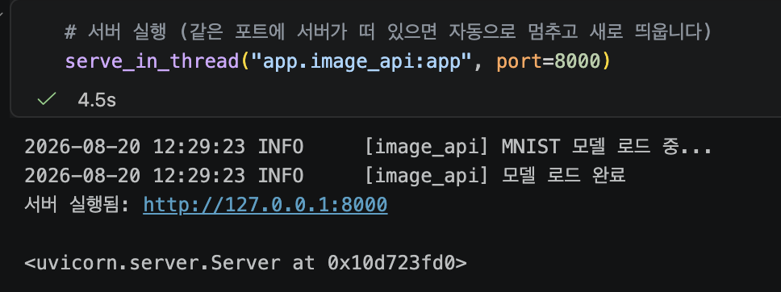
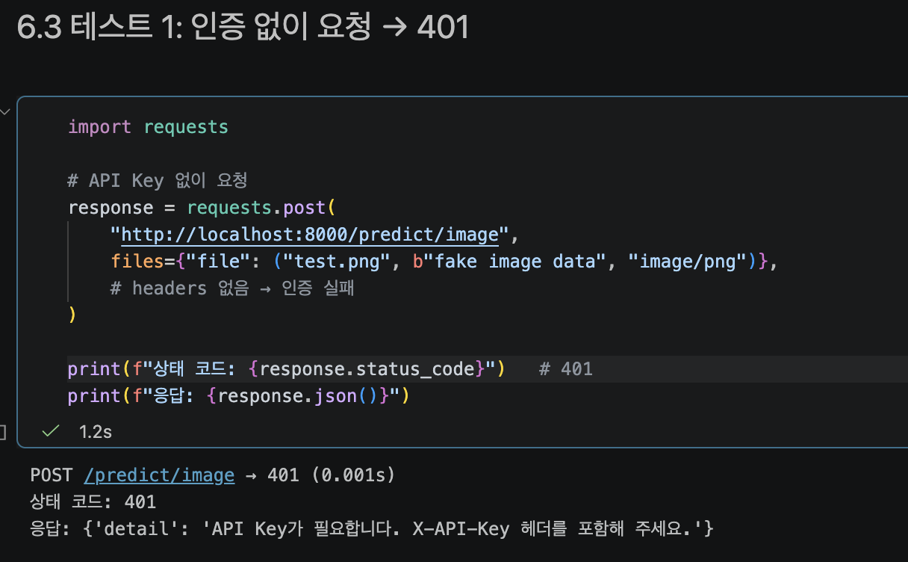
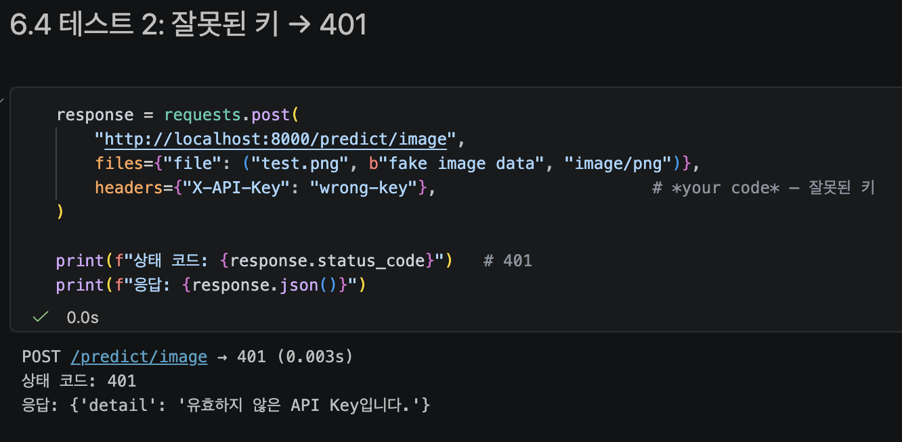
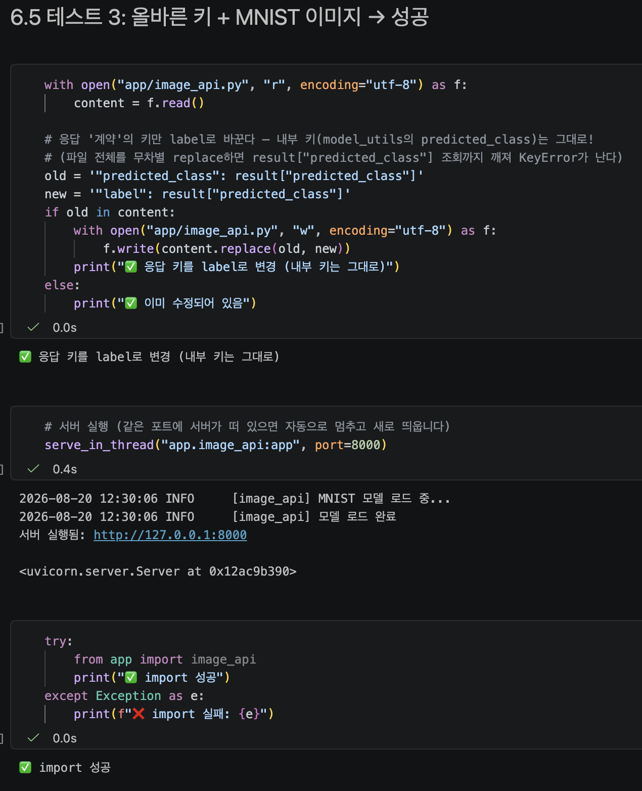
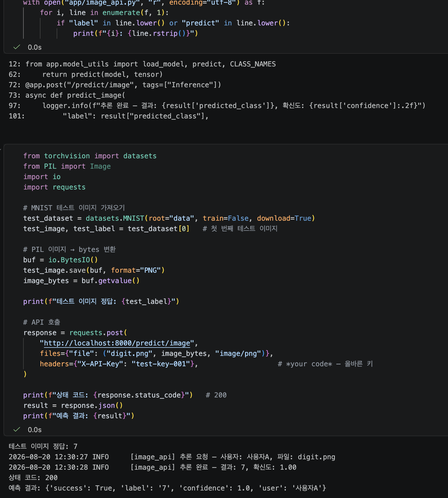
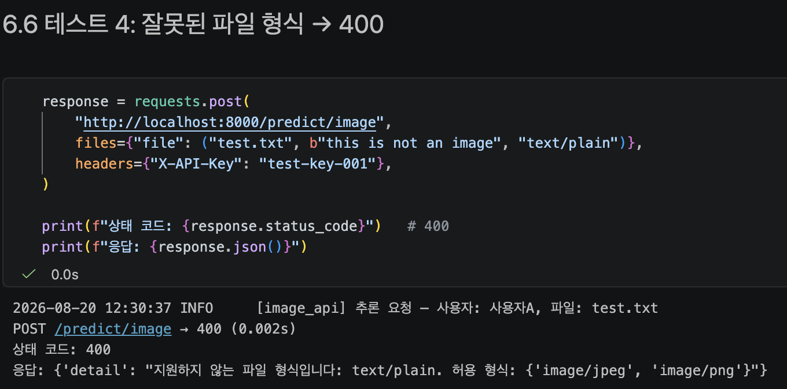
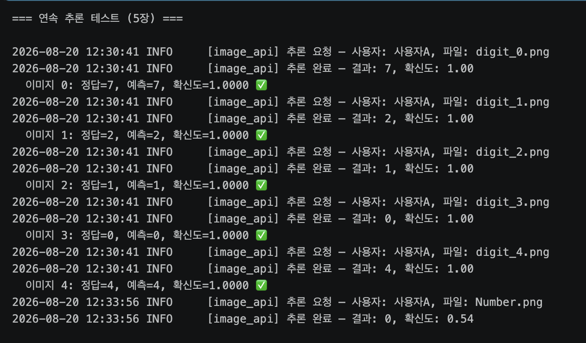
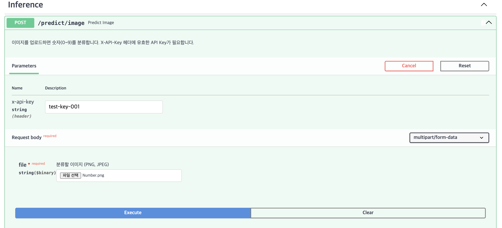
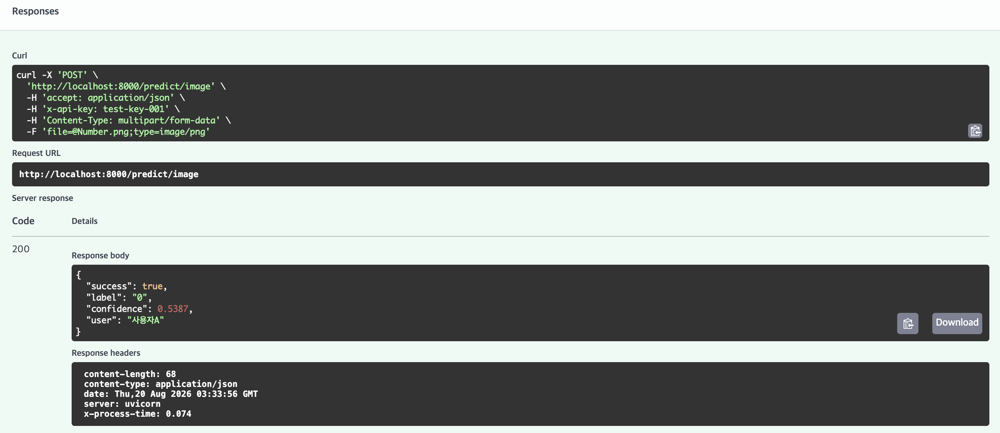

# model_serving_day6

작성일: 2026년 8월 20일 

---

## 섹션 6 수행내역 캡쳐

#### 6.2 서버 실행



#### 6.3-6.7 테스트 1~5

테스트1: 인증 없이 요청할 경우 401(인증 불가) 에러 반환



테스트 2: 목록에 없는 키 전달할 경우 401(인증 불가) 에러 반환 



테스트3: 올바른 키와 MNIST 이미지를 선택할 경우 200(성공) 코드를 확인할 수 있다. 또한 모델 추론 결과를 반환받는다. 





테스트4 : 지원하는 파일 형식(image/png, image/jpeg) 외에 입력할 경우 400(Bad Request) 에러 반환 



테스트 5: 여러 이미지를 연속으로 테스트한 결과, 기존 이미지(digit_*)는 거의 동시에 추론이 이루어졌고, 사용자가 추가로 입력한 이미지(Number)는 추론에 약간의 시간이 소요되었음을 확인할 수 있다. 이는 사용자가 업로드한 원본 이미지를 모델에 맞게 28x28 그레이스케일로 리사이징하고 변환하는 데이터 전처리 과정에 추가적인 연산 시간이 소요되었기 때문으로 추정된다.



#### 6.8 Swagger UI에서 테스트

Swagger UI에서 Post /predict/image 구동 테스트 결과이다 

x-api-key에 적절한 키(목록에 존재)를 입력한 후 이미지를 업로드하고 분석한 결과를 JSON 형식으로 확인할 수 있다. 





---

### ✅ 체크포인트01

1. 인증 없는 API가 위험한 이유를 두 가지 이상 설명하세요.
    1. 인증이 없다는 이야기는 해당 API를 누구나 이용할 수 있다는 것이다. 
    2. 만약 시스템을 망가트릴 의지를 가진 사용자가 초당 수백건의 요청을 무차별적으로 쏟아낼 경우, 서버 과부하로 인해 다운되고 정상 사용자도 서비스를 이용할 수 없게 된다. 
    3. 또한 GPU 서버를 유료 클라우드에 운영중이라면, 불특정 다수의 요청이 이어질 경우 GPU 사용량이 과도하게 증가하고 이는 요금 폭탄으로 이어진다. 
2. API Key 방식이 ML 추론 API에 적합한 이유는 무엇입니까?
    1. 인증방식 중 API Key 방식은 요청 헤더에 키를 포함하는 가장 간단한 방식이다. JWT나 OAuth 2.0과 비교했을 때 복잡도와 보안 수준은 낮다. 그러나 사용자의 로그인이 필요없고, 키 하나로 인증과 사용량 추적이 모두 가능하기 때문에 ML 추론에는 API Key 방식을 가장 흔하게 사용한다. 

---

### ✅ 체크포인트02

1. `Header(None)`에서 `None`은 어떤 상황에서 `x_api_key`에 들어갑니까?
    1. 클라이언트는 요청 헤더에 `X-API-KEY: abcd1234` 를 담아서 보낸다. FastAPI는 함수 파라미터 `x_api_key` 를 확인하고, 규칙에 따라 요청 헤더에서 `X-API-KEY` 항목을 자동으로 찾아 매핑한다. 
    2. Header(None)의 역할을 다음과 같다. 찾아낸 헤더 값(`abcd1234`)를 `x_api_key` 변수에 넣는다. 만약 클라이언트가 요청을 보낼 때 `X-API-KEY`를 헤더에 포함시키지 않았을 경우, 에러를 내지 않고 `x_api_key`에 `None` 을 할당한다.  
2. `Depends(verify_api_key)`를 엔드포인트에 추가하면 요청 처리 흐름이 어떻게 바뀝니까?
    1. 예를 들어 엔드포인트 /predict 에 Depends(verify_api_key)를 추가한다고 가정해보자
        
        ```bash
        # 인증이 적용된 엔드포인트
        @app.post("/predict")
        async def predict(
            request: PredictRequest,
            user: str = Depends(verify_api_key),    # ← 이 한 줄이 인증을 적용합니다
        ):
            # user에는 인증된 사용자 이름("사용자A")이 들어옵니다
            print(f"요청한 사용자: {user}")
            ...
        ```
        
    2. 이 경우, 엔드포인트 /predict 으로 요청이 들어온 경우 FastAPI는 predict() 함수를 실행하기에 앞서 verify_api_key()를 먼저 실행한다. 
        1. verity_api_key() 실행 성공 → 반환값(”사용자A”)이 user 변수에 할당됨
        2. verify_api_key() 실행 실패 → HTTPException 발생 → predict() 실행되지 않고 401 에러코드 반환 
3. 인증 실패 시 반환하는 HTTP 상태 코드 401의 의미는 무엇입니까?
    1. `401 Unauthorized` 는 헤더에 포함된 X-API-KEY의 값을 인식 하였을 때 등록된 키가 목록에 존재하지 않아 인증이 불가하며, 인증이 필요한 엔드포인트로의 접근이 거부됨을 의미한다. 

---

### ✅ 체크포인트04

1. `UploadFile`과 Base64 방식의 핵심 차이는 무엇입니까?
    1. `UploadFile`은 파일을 직접 보내는 방식이고, `Base64`는 이미지를 Base64(64진수)로 인코딩해서 보내는 것이다. 
    2. 이미지를 다른 JSON 데이터와 함께 하나의 요청에 담아야 한다면 `Base64`, 파일을 독립적으로 업로드 한다면 `UploadFile`을 사용한다. 
    3. Base64는 인코딩 과정에서 파일 크기가 약 33% 증가하고 메모리 전체에 문자열을 올려야 하지만, FastAPI의 UploadFile은 내부적으로 파일을 청크(Chunk) 단위로 읽어 임시 파일(SpooledTemporaryFile)로 처리하기 때문에 대용량 파일 전송 시 메모리 효율이 훨씬 좋다. 
2. `file.content_type`으로 타입을 검증하는 이유는 무엇입니까?
    1. file_content_type은 MIME 타입(Multipurpose Internet Mail Extensions), 즉 인터넷을 통해 주고받는 파일의 형식을 알려주는 표준 식별자로 파일의 타입을 검증한다. 컴퓨터가 확장자(`.png` , `.zip` , `.pdf` )를 보고 파일의 타입을 식별하는 것 처럼, 웹 브라우저나 서버는 MIME 타입을 보고 파일의 전체를 파악한다.
    2. MIME 타입은 `대분류(Type)/소분류(Subtype)` 형태로 작성된다. 예를 들어 이미지 파일 중 PNG 형식이라면 `image/png` 가 되는 것이다. 
    3. 그렇다면 왜 확장자 대신에 MIME 타입을 사용하는가. 만약 사용자가 파일의 확장자는 `.png`에서 `.txt`로 바꾼 뒤 웹 서버에 업로드하더라도, 웹 서버는 파일의 실제 내부 데이터를 확인하여 `image/png` 라는 진짜 정체를 검증하고 처리할 수 있다. 
3. 파일 크기를 제한하지 않으면 어떤 문제가 발생할 수 있습니까?
    1. 파일 크기가 제한되지 않아서 불특정 다수가 큰 용량의 파일을 업로드 하게 되면 이를 처리하는게 많은 CPU/GPU가 소비되고 이는 서버 메모리 부족 및 서버 과부하로 이어질 수 있다. 

---

### ✅ Day 6 최종 체크포인트

```
Q1. API Key 인증이 없으면 어떤 위험이 있습니까? (두 가지 이상)
- API Key 인증이 없다면 해당 API 누구나 접근할 수 있다는 것을 의미한다. 
인증이 없을 경우, 
1) 서버에 초당 수백 건의 요청을 무차별적으로 쏟아낼 경우, 서버 과부하로 인해 
다운되고 정상 사용자도 서비스를 이용할 수 없게 된다. 
2) 만약 GPU 서버를 유료 클라우드에 운영중이라면, 불특정 다수의 요청이 이어질 경우 GPU 
사용량이 과도하게 증가하고 이는 요금 폭탄으로 이어진다. 

Q2. Depends(verify_api_key)는 엔드포인트 실행 전에 어떤 일을합니까?
- 엔드포인트의 함수를 실행하기 이전에 verify_api_key()를 실행한다. 실행결과 헤더 요청에서
 넘어온 api key 가 목록에 존재한다면 인증 후 엔드포인트가 실행되고, 목록에 존재하지 않는다면
  401 HTTP 에러 코드를 반환한다. 

Q3. UploadFile 방식이 Base64보다 편리한 점은 무엇입니까?
- UploadFile은 개별 파일을 독립적으로 업로드할 때 선호되는 방법이다. 이미지를 Base64로 
인코딩할 경우 파일 전체가 메모리에 올라가고 기존의 데이터보다 33% 용량이 커진다. 
반면 UploadFile 방식은 데이터를 청크 단위로 나누어 임시파일 형태로 처리하기 때문에 
대용량 파일 전송 시 메모리 효율이 훨씬 좋다. 

Q4. 파일 업로드 시 크기 제한을 하지 않으면 어떤 문제가 생깁니까?
- 파일 업로드 시 크기 제한을 두지 않을 경우, 다수의 대용량 파일이 업로드된다면 이를 
처리하는데 많은 CPU/GPU가 소비되고 이는 서버 메모리 부족 또는 서버 과부하로 이어질 수 있다. 

Q5. 이미지를 28x28 그레이스케일로 변환하는 이유는 무엇입니까?
- MNIST로 분석하는 이미지는 0부터 9까지의 숫자를 손글씨로 쓴 것이다. 이미지의 특성 상 
색상이 이미지를 분류하는데 큰 영향을 주지 않으므로 그레이스케일로 변환할 경우 텐서 차원이 
줄어들어 메모리 효율이 올라간다. 그리고 이미지 크기를 일괄적으로 28x28로 변환함으로써, 
사전에 학습된 모델이 요구하는 입력 형태(Input Shape)와 일치시켜 이미지 분석의 일관성을 
충족시킨다. 
```