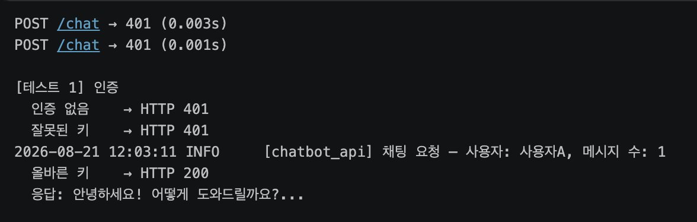
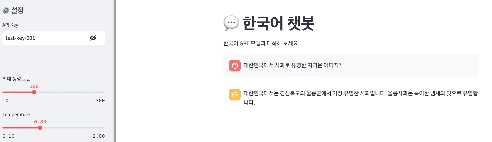

# model_serving_day7

작성일: 2026년 8월 21일

---

## 섹션 6 : 테스트 결과

### 테스트1: 인증

인증이 없거나 잘못된 키를 입력할 경우: 401 에러 코드 반환  

올바른 키를 입력한 경우 : 200 코드 반환 



### 테스트2: 멀티턴 대화


### 테스트3: 입력 검증

빈 텍스트를 보내거나 temperature가 기준치를 초과할 경우 : 422 에러 코드 반환 


### 테스트4: 동시 요청 (4건)

1. **시작 시간 동일:** 4개의 요청이 모두 `12:05:04`에 동시에 접수되었습니다.
2. **총 소요 시간과 최대 소요 시간의 일치:**
    - 개별 요청의 처리 시간은 각각 `8.1초`, `13.2초`, `16.0초`, `13.6초`입니다.
    - 만약 동기식(대기-실행-대기-실행 방식)으로 하나씩 순차적으로 처리되었다면, 전체 소요 시간은 대략 **50.9초**(8.1 + 13.2 + 16.0 + 13.6)가 되어야 합니다.
    - 하지만 실제 **전체 소요 시간은 16.1초**로, 가장 오래 걸린 세 번째 요청의 시간(16.0초)과 거의 같습니다.

즉, 4개의 요청이 순서를 기다리지 않고 비동기적으로 실행되었으며, 가장 늦게 끝난 작업이 완료되는 시점에 전체 테스트가 종료되었습니다. 


## UI 테스트

### [테스트 A] 기본 대화

1. 사이드바에 API Key 입력
2. "안녕하세요" 입력 → 봇 응답 확인
3. 추가 메시지 입력 → 멀티턴 대화 확인


### [테스트 B] 설정 변경

1. Temperature를 0.1로 낮추기 → 보수적인 응답 확인
2. Temperature를 1.5로 올리기 → 다양한 응답 확인

0.8, 0.1, 1.5를 비교하였을 때, 0.8의 경우 문장이 가장 매끄러운면서 오류가 가장 적습니다. 0.1의 경우 0.8 비교하였을 때, 제시한 지역은 동일하지만 “가장 유명한” 에서 “가장 유명한 지역 중 하나” 로 문장의 뉘앙스가 변화했습니다. 그리고 중간에 한자가 섞여서 나오는 점을 확인할 수 있습니다. Qwen이 중국에서 개발된 모델이라 학습 데이터에 한자어 비중이 높아서 temperature을 낮췄을 때 한자어 토큰이 채택된 것으로 보입니다. 

다만 0.8과 0.1의 경우 문장은 매끄럽게 생성되었으나, 소형 모델(1.5B)의 한계 혹은 학습 데이터 부족으로 인해 '울릉군이 사과로 유명하다'는 사실적 오류(환각)를 기본적으로 범하고 있습니다.

1.5의 경우 주요산지에 대한 이야기에서 시작했으나 맥락을 이해할 수 없는 문장이 섞여있습니다. 이는 temperature 값이 높아졌을때 엉뚱한 답변이 나오거나 환각이 발생할 수 있다는 것을 명확히 보여줍니다. 




### [테스트 C] 대화 초기화

1. 여러 턴 대화 후 "대화 초기화" 클릭
2. 대화 기록이 사라지는지 확인


### [테스트 D] 인증 실패

1.  API Key를 wrong-key로 변경
2.  메시지 입력 → "🔑 인증 실패" 메시지 확인


---

### ✅ 체크포인트01

1. Day 5(정형 데이터)와 Day 7(텍스트 생성)에서 전처리가 어떻게 다릅니까?
    1. 정형 데이터의 경우 서로 다른 크기 및 단위를 가지는 데이터들을 정규화(mean/std) 해주는 전처리 과정이 필요하고, 텍스트라는 비정형 데이터의 경우 텍스트를 컴퓨터가 이해할 수 있는 단위로 잘게 쪼개어 주어야 한다. 한국어의 경우 형태소 단위로 쪼개어 주는데 이를 “토큰화”라 부른다.
2. Hugging Face Transformers 라이브러리의 역할은 무엇입니까?
    1. 허깅페이스의 Transformers 라이브러리는 자연어 처리(NLP), 컴퓨터 비전(CV), 음성 인식 등 다양한 인공지능 분야의 최신 사전 학습(Pre-trained) 모델을 코딩 몇 줄로 쉽게 쓰고 고쳐 쓸 수 있게 해주는 오픈소스 파이썬 라이브러리이다.

---

### ✅ 체크포인트02

1. 토크나이저의 `encode()`와 `decode()`는 각각 어떤 변환을 수행합니까?
    1. `encode()`는 대화 기록을 입력 받아서 `model.generate()` 함수가 인식할 수 있는 PyTorch Tensor(`torch.Tensor`) 형태로 변환시킨다. 
        
        ```bash
        input_ids = tokenizer.encode(prompt, return_tensors="pt").to(device)
        ```
        
    2. `decode()`는 모델이 생성한 숫자 ID 배열을 사람이 읽을 수 있는 문자열로 변환한다. `skip_special_tokens=True` 조건이 추가되어 있으므로, 특수 토큰은 문자열에서 제외된다. 
        
        ```bash
        full_response = tokenizer.decode(output_ids[0], skip_special_tokens=True)
        ```
        
2. `model.generate()`의 `temperature` 파라미터는 생성 결과에 어떤 영향을 줍니까?
    1. 모델이 다음 토큰을 예측할 때 계산한 로짓(Logits)값을 `temperature`로 나눈 뒤 소프트맥스(Softmax)를 취해 확률 분포를 조정한다. 
    2. `temperature`가 낮은 경우 높은 확률을 가진 소수의 유력한 토큰에 확률이 극단적으로 쏠리게 되고, 가장 안전하고 예측 가능한 토큰만이 선택되므로 보수적이고 일관된 텍스트가 생성된다
    3. 반대로 `temperature`가 높으면 토큰 간의 확률 격차가 줄어들어 분포가 평평해진다. 상대적으로 낮은 확률의 토큰도 선택될 기회가 늘어나므로 창의적이고 다양한, 자유도가 높은 문장이 생성된다. 다만 너무 높으면 엉뚱한 말이나 환각이 발생할 수 있다. 
3. 멀티턴 대화에서 이전 대화 기록을 프롬프트에 포함하는 이유는 무엇입니까?
    1. 매끄러운 대화가 이어지기 위해서는 텍스트를 생성할 때 발화 전후의 맥락을 인식해야 한다. 따라서 멀티턴의 대화를 구현하기 위해서는 이전 대화 기록을 프롬프트에 포함시켜 어떤 맥락 속에서 대화가 이루어지고 있는지를 파악할 수 있게 해야한다. 

---

### ✅ 체크포인트03

1. `ChatRequest`의 `messages`가 리스트인 이유는 무엇입니까?
    1. 대화의 맥락을 유지하기 위해서 대화 기록 전체를 리스트로 받는다.
2. 서버가 대화 기록을 저장하지 않고, 클라이언트가 매번 전체 기록을 보내는 이유는?
    1. 서버 무상태(서버가 클라이언트의 이전 요청이나 로그인 같은 상태 정보를 기억하지 않고, 들어온 요청만 각각 독립적으로 처리)에 따라 서버는 대화 기록을 저장하지 않는다. 따라서 클라이언트가 대화 기록을 관리하고, 매 요청 마다 전체 기록을 보낸다. 
3. `max_new_tokens`을 너무 크게 설정하면 어떤 문제가 발생할 수 있습니까?
    1. 모델이 불필요하게 긴 답변을 생성하느라 응답 시간이 매우 오래 결릴 수 있다. 또한 생성 과정에서 GPU 메모리를 과도하게 사용하여 시스템이 다운될 수 있다. 긴 답변을 채우기 위해 묻지 않은 내용까지 생성하다 환각을 이어갈 위험도 커진다. 

---

### ✅ 체크포인트04

1. `st.chat_message`와 `st.chat_input`은 각각 어떤 역할을 합니까?
    1. `st.chast_input` 은 사용자가 텍스트를 입력할 수 있는 입력창 UI를 제공하고, `st.chat_message`는 화면에 사용자와 봇의 대화를 말풍선 형태의 UI로 시각화하여 보여주는 역할을 한다. 
2. `st.session_state["chat_messages"]`에 대화 기록을 저장하는 이유는?
    1. user와 bot의 앞선 대화들을 바탕으로 새로 생성되는 텍스트가 대화의 맥락을 이어갈 수 있도록 하기 위해서 `st.session_state["chat_messages"]`에 대화 기록을 저장하고 이를 모델에게 전달한다.
3. "대화 초기화" 버튼이 `st.rerun()`을 호출하는 이유는 무엇입니까?
    1. 대화를 초기화 한다는 것은 현재 진행중인 스크립트를 멈추고 코드를 맨 처음부터 재시작 한다는 것을 의미한다. Streamlit에서 st.rerun()을 실행하게 되면 그 아래에 있는 코드는 실행하지 않고 즉시 멈추고, 위에서부터 다시 코드를 읽어와 화면을 새롭게 바꾼다. 
    2. 본 프로젝트에서 st.rerun() 코드의 위치를 보면, st.sessiont_state[”chat_messgaes”] = [] 으로 대화가 초기화 된 상태에서 st.rerun()이 실행된다. 따라서 대화 기록을 초기화 한 상태에서 스크립트는 재시작 하게 되므로 이전 대화 기록이 없는 초기화 상태가 가능해진다. 

---

### ✅ 체크포인트05

1. 챗봇 API에서 인증이 실패하면 서버는 어떤 상태 코드를 반환합니까?
    1. 유효하지 않은 API Key를 입력한 경우 `401 Unautorized` 상태 코드를 반환한다. 
2. UI의 `call_chat_api()`는 401 응답을 받으면 사용자에게 무엇을 보여줍니까?
    1. `🔑 **인증 실패.** API Key를 확인하세요.` 라는 메세지를 보여준다. 
        
        ```bash
        except requests.exceptions.HTTPError as e:
                if e.response.status_code == 401:
                    st.error("🔑 **인증 실패.** API Key를 확인하세요.")
        ```
        
3. Day 6의 인증 모듈(`app/auth.py`)을 Day 7에서 수정 없이 재사용할 수 있는 이유는 무엇입니까?
    1. API Key 를 이용한 시스템은 사용자가 입력한 키 값이 유효한 경우 사용자를 인증해주는 시스템이다. 기타 사용자의 정보나 로그인이 필요하지 않은 시스템이므로 서비스 형태에 상관없이 공통적으로 사용 가능하다. 따라서 API Key를 사용하여 인증을 진행하는 경우 수정 없이 사용이 가능하다. 

---

### ✅ Day 7 최종 체크포인트

```
Q1. Day 5(정형 데이터)와 Day 7(텍스트 생성)에서 전처리 방식의 차이는?
- 정형 데이터의 경우, 각 피처들의 크기, 단위 등을 정규화시켜주는 방식을 사용한다. 
반면에 텍스트의 경우 비정형 데이터로, 컴퓨터가 이 데이터를 이해할 수 있는 형태로 전환해주어야 한다. 
컴퓨터가 문장을 이해할 수 있는 최소 단위로 쪼개는 과정을 토큰화라고 한다. 

Q2. 멀티턴 대화에서 서버가 상태를 유지하지 않는 이유는?
- 서버 무상태(서버가 클라이언트의 이전 요청이나 로그인 같은 상태 정보를 기억하지 않고, 들어온 요청만 
각각 독립적으로 처리)에 따라 서버는 대화 기록을 저장하지 않는다. 따라서 클라이언트가 대화 기록을 
관리하고, 매 요청 마다 전체 기록을 보낸다. 

Q3. API Key가 잘못되면 서버는 어떤 상태 코드를 반환하고, UI는 어떻게처리합니까?
- API Key가 잘못 입력된 경우 서버는 401 상태 코드를 반환하고, 
UI 에서는 "🔑 **인증 실패.** API Key를 확인하세요." 메세지를 전달한다. 

Q4. temperature를 낮추면 생성 결과에 어떤 변화가 있습니까?
- temperature 값이 낮아지면 모델은 '가장 확률이 높고 안전한' 단어 조합을 선택하려는 경향이 
강해진다. 따라서 보수적이고 안정적인 텍스트가 생성될 가능성이 높아진다. 

Q5. 이 서비스를 다른 컴퓨터에서 실행하려면 무엇이 필요합니까?
- 사용자 입장(접속만 할 경우)에서는 배포된 UI 페이지의 웹 주소(URL)과 유효한 API Key가 필요하다.
개발자 입장에서 직접 구동하려고 한다면 파이썬 환경, 소스코드 세트, 그리고 라이브러리 목록을 통한 의존성
설치가 필요하다. 
```